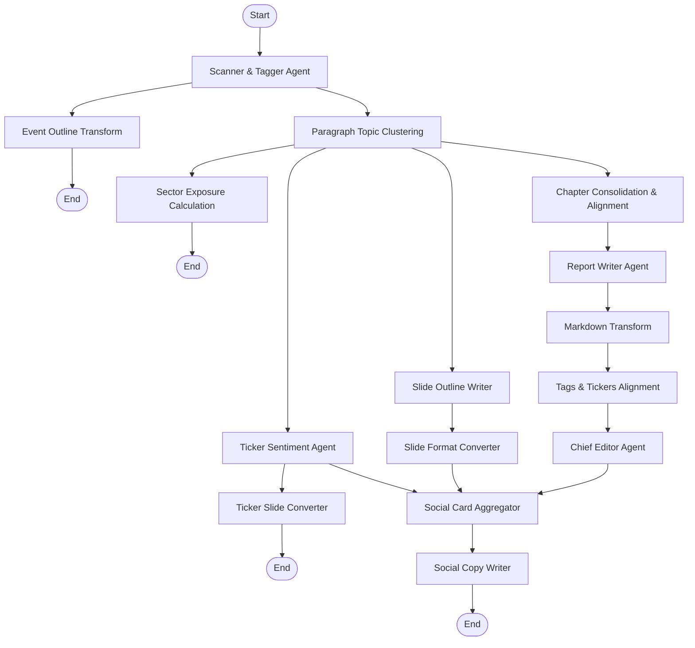

I recently spent time rebuilding the AI data pipeline responsible for processing unstructured **financial podcast** audio streams and transcripts, taking it from a basic single ingestion script to a production-grade multi-agent architecture.

In practice, the hardest part was never speech-to-text. Turning audio into a raw transcript through cloud transcription services is cheap and effectively solved. The real challenge is **producing stable, high-quality, schema-conformant financial summaries and market ticker analysis out of transcripts that are extremely redundant and full of noise**.

In this post, I want to share the architectural decisions behind this evolution: how I worked past the limits of "please summarize this transcript", and used LangGraph to design a cooperative multi-agent processing graph.

---

## Why "please summarize this transcript" was always going to fail

My first-generation ingestion script did the obvious thing: take the raw transcript, wrap it in a simple prompt, send it to a large language model, and ask for "a summary, key points, and any market ticker data mentioned".

Against real podcast episodes, the output was unusable. Real conversational audio is full of noise:

1. **Ads and sponsor reads (Sponsor Announcements)**: Hosts drop VPN, online course, or brokerage ads into the intro or middle of an episode. The model happily mistakes them for "financial insights" and writes them into the summary.
2. **Small talk and jokes (Chitchat & Intro)**: Hosts warm up for several minutes before the actual topic. Entertaining for listeners, but pure noise for readers seeking financial insights.
3. **Verbal filler and non-linear thinking**: Two-host shows and interviews are full of digressions. A transcript often runs 20,000 to 30,000 characters, of which maybe 10% carries real value.
4. **Interleaved speakers and lost in the middle**: Conversations jump rapidly between tickers with throwaway interjections. Swallowing the entire transcript at once causes model attention to degrade over long contexts, dropping key tickers silently.

If you feed the raw transcript into a single prompt, the model either drifts due to context length or crashes on malformed JSON outputs. To produce professional-grade financial insights, I realized the pipeline had to be decoupled into specialized agents.

---

## Multi-Agent Design with LangGraph

To overcome single-prompt limitations, I chose LangGraph to reconstruct the workflow.

LangGraph's `StateGraph` concept is ideal for complex Directed Acyclic Graph (DAG) workflows. We define a shared `State` object where each node processes a slice of data, updates the state, and passes it forward. This decouples filtering, chapter consolidation, report writing, ticker extraction, and chief-editor verification.

### System Topology

Here is the actual `StateGraph` topology used in the project, featuring parallel fan-out and fan-in stages:

---

## Core Agents and Node Responsibilities

In this workflow, each node has strict boundaries:

### 1. Scanner & Tagger Agent (`extract_events`)
* **Role**: Noise removal and event scanning.
* **Logic**: The first line of defense. It scans the raw transcript and categorizes segments into closed vocabulary tags (sponsor, intro, outro, chitchat, analysis, guest, qa, unknown), marking whether a segment contains substantive market content.
* **Sentence-Position Chunking**: Ultra-long transcripts cause structured JSON outputs to truncate. I designed sentence-position chunking: when sentence count exceeds a threshold, the transcript is sliced into chunks of 800 sentences. Local index offsets are re-mapped back to global positions upon merging.

### 2. Policy Router & Chapter Consolidator (`cluster_sentences` & `consolidate_chapters`)
* **Role**: Structured timeline and chapter alignment.
* **Logic**: Combines deterministic logic. The policy router drops non-substantive segments (sponsors, chitchat) based on profile policies. The chapter consolidator dynamically calculates target chapter counts based on episode duration (1 chapter per 5 minutes, min 4, max 12), merging fine-grained events into coherent chapters.

### 3. Report Writer Agent (`write_article`)
* **Role**: Content organization and prose drafting.
* **Logic**: Ignores noisy raw transcripts and expands upon consolidated clean chapters into a structured financial report draft. Employs chunked writing when chapter count is high to prevent token overflow.

### 4. Chief Editor Agent (`extract_key_insights`)
* **Role**: Fact-checking and key takeaway extraction.
* **Logic**: Reads the Markdown report, extracts 3 to 8 concise key insights, and strips formatting artifacts to stay within 80 characters per insight. Features a deterministic fallback to slice sentences from the main body if LLM generation yields fewer than 3 takeaways.

### 5. Ticker Sentiment Agent (`extract_tickers`)
* **Role**: Deep sentiment and risk analysis per market ticker.
* **Logic**: Extracts bullish/bearish/neutral sentiment, price targets, and risks per ticker mentioned, linking them to domain vocabulary and sector exposures.

---

## Conclusion of Part 1

By decoupling a single prompt into distributed LangGraph nodes, we solved context truncation and advertisement noise while establishing dedicated AI roles.

However, moving to production introduced new challenges:
* How do we avoid restarting expensive audio transcription when a downstream agent fails?
* Why do reasoning models truncate structured JSON outputs mid-stream?
* How do we prevent hallucinated data from being written to production databases?

In Part 2, I will dive into our production solutions: **Step-by-step Checkpoints, Reasoning Token Budget Management, and Pre-Persistence Gates**.

---

## Reference

- **[LangGraph Documentation](https://langchain-ai.github.io/langgraph/)**: Learn how to use StateGraph, Nodes, and Edges to build cyclic and branching multi-agent systems.
- **[Python asyncio Documentation](https://docs.python.org/3/library/asyncio.html)**: Master async workflows, tasks, and concurrency semaphores.
- **[LangChain OpenAI Integration Guide](https://python.langchain.com/docs/integrations/chat/openai/)**: Configure chat models and custom parameters.
