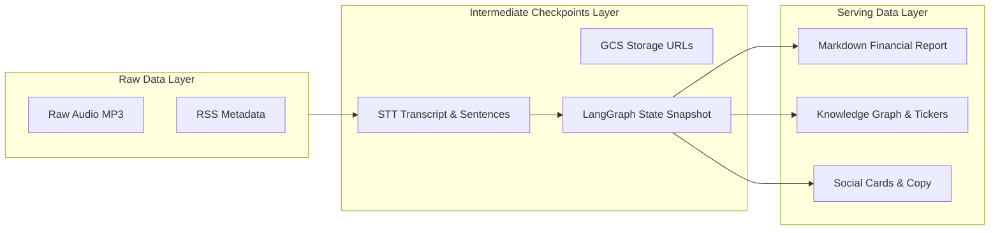
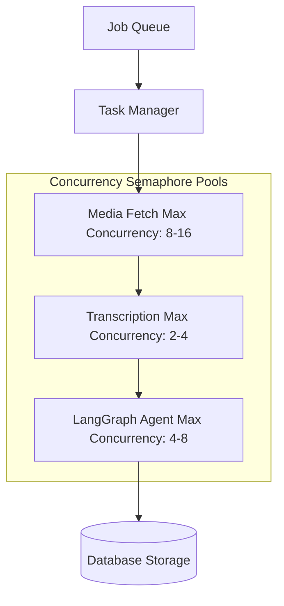

In Part 1, I shared how we decoupled a complex unstructured **financial podcast audio stream** processing workflow using LangGraph to build a cooperative multi-agent topology.

However, running this system in production presented new engineering challenges:
* Long audio streams and multi-agent workflows involve significant API latency and financial cost. If a downstream node fails, do we really have to re-transcribe the entire audio file?
* When using reasoning models to refine insights, why do structured JSON outputs cut off mid-stream?
* When an LLM hallucinates or partially fails, how do we prevent incomplete placeholder data from corrupting historical production records?

In this post, I will dive into four key production solutions: **Step-by-step Checkpoints, Reasoning Token Budget Management, Pre-Persistence Gates, and Concurrency Controls**.

---

## 1. Step-by-Step Checkpoints and the Recoverable Data Factory

In earlier naive implementations, the pipeline persisted results only when all steps completed. But processing an episode involves downloading audio, STT transcription, multi-agent summarization, and social card rendering, taking several minutes.

If the pipeline failed at the very last stage due to a rendering error, re-running the entire job wasted minutes of latency and duplicated expensive transcription API calls.

To build a truly resilient system, I structured the data layer into three distinct tiers:

### Implementing `rerun_from` Recovery

At each major stage, intermediate state (downloaded audio, transcript sentence structures, storage URLs) is persisted immediately.

I introduced a `rerun_from` parameter. When a job fails down the line, operators or background retry tasks can specify a recovery starting point. For instance, setting `rerun_from="summarize"` loads existing transcript snapshots directly, bypassing audio downloads and STT transcription, and feeds the state straight into the LangGraph state graph.

This eliminates over 80% of retry latency and completely prevents duplicate transcription costs.

---

## 2. Model Selection and Reasoning Token Truncation

Model selection directly governs output quality and system stability. I evaluated several models using OpenRouter across multiple test runs:

| Metric | Reasoning Models (e.g. DeepSeek) | Fast Benchmark Models (e.g. Gemini Flash) |
| :--- | :--- | :--- |
| **Summary Density & Structure** | Compact with professional editorial tone. Accurately filters out chitchat and ads. | More verbose and literal. Tends to keep all small talk and Q&A clutter. |
| **Tags & Ticker Accuracy** | Moderate tag count, highly compliant with closed-vocabulary constraints. Precise ticker extraction. | Severe tag inflation, inventing invalid tags that fail validation gates. |
| **Ticker Sentiment Extraction** | Aligns paragraphs precisely into structured bullish/bearish arguments and risk factors. | Broad coverage but lower information density. |

### Production Pitfall: Missing `max_tokens` Budget

While reasoning models won on summary quality and ticker precision, I ran into a severe production bug: **For long episodes, structured JSON outputs frequently cut off mid-stream with `Unterminated string` errors.**

Investigation revealed that reasoning models consume a vast amount of tokens on internal reasoning thoughts, severely squeezing the available `max_tokens` budget (e.g., 4096 tokens). When internal thinking takes up too much budget, the JSON output is forcefully truncated.

### Fix: Disabling Reasoning Thoughts Explicitly

To resolve this, I explicitly **disabled reasoning thoughts in API calls** (passing `extra_body={"reasoning": {"enabled": False}}`).

As a result, the model no longer consumes budget on internal thinking tokens and allocates the full token budget to the structured JSON payload, eliminating mid-stream truncation errors entirely.

---

## 3. Pre-Persistence Gate (`assert_summary_persistable`)

When API calls fail or when an LLM hallucinates, extracted ticker lists can become inconsistent with the Markdown body (e.g. a ticker list containing AAPL while the summary text makes no mention of Apple). Persisting these errors overwrites historical good data.

I added a strict memory validation gate (`assert_summary_persistable`) before any database write:

1. **Reject Placeholders**: Inspects outputs for any placeholder strings, blocking persistence if present.
2. **Ticker Mismatch Gate**: Verifies that every ticker in `related_tickers` appears explicitly in the Markdown summary body with proper formatting (`#ticker:SYMBOL`).

If any ticker in the list is missing from the main body, the system flags a Ticker Mismatch, throwing an exception and rejecting the database write to preserve data integrity.

---

## 4. Concurrency Budgets and Rate Limits

Multi-agent coordination fires multiple API calls per job. Processing multiple episodes concurrently easily triggers 429 Rate Limits from model providers.

I used Python `asyncio.Semaphore` to allocate independent concurrency budgets per stage:

Decoupling concurrency budgets prevents cheap network fetches from blocking model calls, keeping parallel request volumes within safe thresholds.

---

## Visual Plan

### Figure 1: Linear vs. Recoverable Data Factory
* **Purpose**: Contrast a simple linear LLM pipeline with a recoverable multi-agent checkpoint factory.
* **Placement**: Start of Section 1 (Checkpoints).
* **Caption**: `Recoverable data factory: Raw, Checkpoint, and Serving tiers for failure recovery.`
* **Inspiration**: Netflix Tech Blog style architecture diagrams with clean blue/gray tones and labeled snapshots.

### Figure 2: Concurrency Budget Dashboard
* **Purpose**: Visualize concurrency throttling across pipeline stages.
* **Placement**: Section 4 (Concurrency Budget).
* **Caption**: `Stage concurrency limits prevent API 429 Rate Limits.`
* **Inspiration**: Stripe Technical Blog rate limiter dashboard style.

---

## Conclusion

Building a production-grade financial podcast ingestion pipeline is not about how powerful a single LLM is, but **how well you engineer an unpredictable model call inside a predictable, recoverable software system**.

Key lessons:
1. **Decouple into Multi-Agent Topologies**: Use LangGraph to eliminate noise and truncation.
2. **Implement Step-by-Step Checkpoints**: Preserve state snapshots to save time and API costs.
3. **Disable Reasoning Tokens**: Prevent JSON truncation in reasoning models.
4. **Enforce Pre-Persistence Gates**: Reject placeholders and ticker mismatches before database writes.

This architecture ensures our data pipeline consistently delivers high-quality financial knowledge graphs despite conversational noise.

---

## Reference

- **[LangGraph Documentation](https://langchain-ai.github.io/langgraph/)**: Build cyclic and branching multi-agent graphs.
- **[LangChain OpenAI Integration Guide](https://python.langchain.com/docs/integrations/chat/openai/)**: Configure ChatOpenAI and custom parameters.
- **[OpenRouter API Documentation](https://openrouter.ai/docs)**: Understand model routing and rate limit handling.
- **[Python asyncio Documentation](https://docs.python.org/3/library/asyncio.html)**: Learn asyncio semaphores and task loops.
