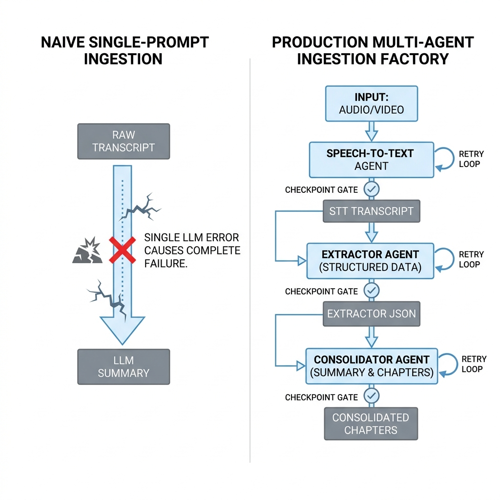
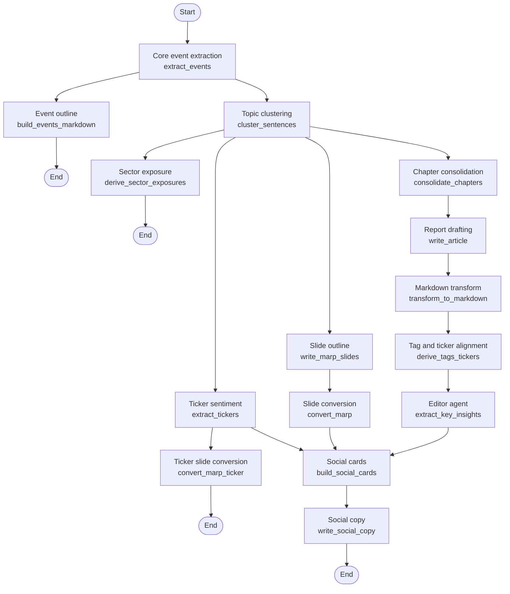
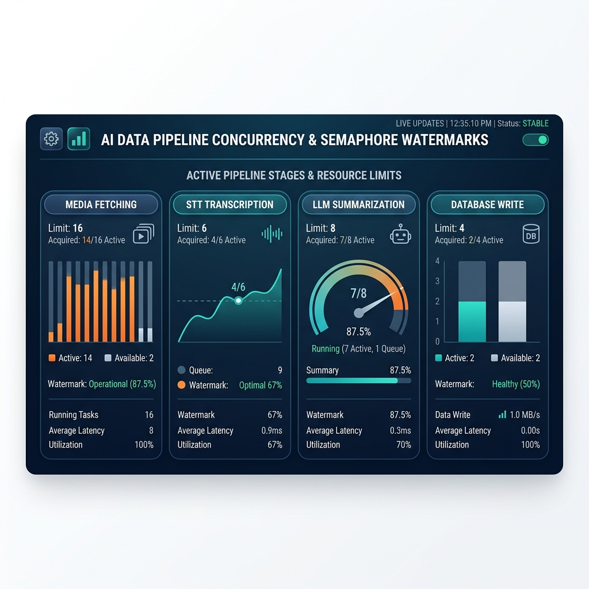

I recently spent a while rebuilding the AI data pipeline that processes **financial podcast** audio and transcripts, taking it from a single ingestion script to a production-grade multi-agent workflow.

What I found is that the hard part was never speech-to-text. Turning audio into a raw transcript through a transcription service such as the Groq API is cheap and effectively solved. The hard part is **producing stable, high-quality, schema-conformant financial summaries and ticker analysis out of transcripts that are extremely redundant and full of noise**.

This post is a record of that evolution: how I worked past the limits of "please summarize this transcript", and ended up with a system where several agents cooperate and every expensive step is checkpointed.

---

## Why "please summarize this transcript" was always going to fail

My first ingestion script did the obvious thing: take the raw transcript, wrap it in a simple prompt, send it to a large language model, and ask for "a summary, the key points, and any market ticker data mentioned".

Against real podcast episodes, the output was unusable, because real conversational audio is full of noise:

- **Ads and sponsor reads.** Hosts drop VPN, mattress, online course, and brokerage ads into the intro or the middle of an episode. The model happily mistakes them for the episode's "financial insight" and writes them into the summary.
- **Small talk and jokes.** Hosts usually warm up for several minutes before the actual topic. Entertaining for listeners, pure noise for a reader who wants the analysis.
- **Verbal filler and non-linear thinking.** Two-host shows and interviews are full of filler words and digressions. A transcript often runs 20,000-30,000 characters, of which maybe 10% carries real value.
- **Interleaved speakers.** In interviews and multi-host shows, the conversation jumps between tickers, with throwaway interjections in between. Swallow all of it at once and the model's attention degrades over the long context (lost in the middle), so the summary is detailed in places and silently drops key names in others.

Feed a whole transcript through one prompt and the model either drifts off topic because the context is too long, or breaks on format. To get a genuinely professional, noise-free financial digest, the task had to be decomposed and handed to specialized agents.

---

## A multi-agent design on LangGraph

To get past the limits of a single model call, I rebuilt the workflow on LangChain and **LangGraph**.

LangGraph's StateGraph fits this kind of DAG well. You define one shared state object, each node touches only the slice of state it owns, updates it, and passes it on. That decouples reading, filtering, chapter consolidation, report writing, ticker analysis, and quality validation from each other.

### Graph topology

This is the StateGraph topology I actually run. Execution enters at one node, fans out, and fans back in at the end:

---

## What each agent and node is responsible for

Every node in this workflow has an explicit input, output, and constraint.

### 1. Extraction agent (`extract_events`)

- **Responsibility:** noise removal and core event extraction.
- **How it works:** this is the front line. It reads the raw transcript, and its job is not to summarize but to scan and label. It classifies passages into a closed vocabulary of tags (sponsor, intro, outro, chitchat, analysis, guest, qa, unknown) and marks whether each passage carries market substance (`is_substantive`).
- **Sentence-position chunking:** sending a very long podcast transcript to the model in one call gets the returned JSON truncated by output limits. So when the sentence count crosses a threshold (1,200 sentences), the transcript is split into chunks of 800 sentences, each call's local indices are offset back into global positions, and the results are merged. This removed the long-transcript truncation problem entirely.

### 2. Policy router and chapter consolidator (`cluster_sentences` & `consolidate_chapters`)

- **Responsibility:** building a structured timeline and aligning chapters.
- **How it works:** these nodes combine model output with deterministic code.
  - **Policy router:** using the show's configured policy, it drops non-substantive passages outright (sponsor, intro, outro, chitchat) and keeps only segments with analytical value. Keyword matching used to let ads slip through; this does not.
  - **Chapter consolidator:** because the extraction agent slices aggressively to filter ads, events come out very fine-grained — a single question and answer can become its own event. Writing directly from those fragments produces a disjointed report. The consolidator derives a target chapter count from episode length (one chapter per five minutes, minimum four, maximum twelve) and merges adjacent fragments into chapters of a workable size.

### 3. Writing agent (`write_article`)

- **Responsibility:** organizing content and drafting prose.
- **How it works:** it never reads the long, noisy raw transcript. It expands on the clean consolidated chapters and turns them into a coherent, professional first draft.
- **Chunked writing:** as in extraction, when there are too many chapters the writer runs in chunks (twelve chapters per call) and the resulting headings, intro, body, and conclusion are merged afterwards, so a single response never overflows its token budget.

### 4. Editor agent (`extract_key_insights`)

- **Responsibility:** fact-checking and quality distillation.
- **How it works:** the quality gate of the line. It reads the drafted Markdown report and distills 3-8 concise takeaways, then cleans them strictly (stripping Markdown syntax, list markers, timestamps) so that each takeaway stays under the length the frontend card layout allows.
- **Fallback:** when the model returns fewer than three takeaways, a deterministic fallback splits the Markdown summary on sentence boundaries and picks sentences that fit the length limit, so the database field always honors the 3-8 takeaway contract.

### 5. Ticker analysis agent (`extract_tickers`)

- **Responsibility:** per-ticker sentiment and risk.
- **How it works:** it focuses on the tickers mentioned in the episode, extracting sentiment (bullish, bearish, neutral), target prices, and stated risks as a structured rating.

---

## Production lessons

A few things I learned while evolving this system.

### 1. Step-by-step checkpoints

The full ingestion pipeline covers audio download, speech-to-text, the LangGraph summarization graph, and uploads to object storage and the database. With many model calls in the graph, an end-to-end run can take several minutes. If every downstream failure — slide conversion, social card rendering — forced a rerun from scratch, both the API bill and the waiting would be brutal.

So each major step persists a **checkpoint**: the downloaded audio, the transcript text and sentence structure, the uploaded object URLs, and so on.

On top of that I added a `rerun_from` parameter. If Markdown transformation, ticker analysis, or card rendering fails, the rerun loads the stored intermediate state first. Setting `rerun_from` to the summarization stage, for instance, pulls the existing transcript from object storage and feeds it straight into LangGraph, skipping the MP3 download and the speech-to-text call. That saves both latency and repeated transcription cost.

### 2. Model selection, and what OpenRouter testing showed

I used **OpenRouter** to evaluate models against each other — a primary reasoning model versus a control model such as Gemini 2.5 Flash — on distillation quality, tag and ticker extraction precision, and fidelity in Traditional Chinese.

#### Head-to-head

Two representative models, several rounds, clearly different characters:

| Dimension | Reasoning model (DeepSeek as representative) | Control model (Gemini 2.5 Flash as representative) |
| :--- | :--- | :--- |
| **Summary length and structure** | Tight, with an editorial feel (5 chapters). Filters career and cost-of-living chatter automatically. | Longer and more literal (9 chapters). Tends to keep every Q&A exchange and the small talk at the end. |
| **Tag and ticker quality** | Moderate tag count, closely obeying the project's closed tag vocabulary, which prevents category fragmentation. Ticker symbols extracted accurately. | Severe tag inflation (over a hundred), including invented tags such as random English words, most of which validation later strips. |
| **Ticker sentiment** | Aligns precisely to passages and produces complete bull/bear arguments with risks. | Broad coverage, lower information density. |

#### The truncation trap with reasoning models

The reasoning model clearly won on tightness and ticker precision, but it came with a trap: on long episodes, extraction and ticker analysis kept returning JSON that was cut off partway through (`Unterminated string` and similar parse errors), failing the task and falling back to a placeholder state.

The cause turned out to be that reasoning models spend a large number of tokens on hidden thinking, which eats into the same `max_tokens` budget (4,096) that the actual output needs.

The fix was to **explicitly disable the reasoning trace** in the API call (`extra_body={"reasoning": {"enabled": False}}`). With the full budget available for structured JSON output, the truncation on long episodes went away.

I then made the reasoning model the default for every role (extraction, writing, editing, ticker analysis) and standardized the model configuration across the background daemon and the manual debugging scripts, so an inconsistent environment can no longer cause a silent placeholder downgrade.

### 3. A pre-persistence validation gate

In earlier versions, a failed summarization service returned placeholder content, and model hallucination could leave the extracted ticker list inconsistent with the summary body — a ticker in `related_tickers` that the prose never mentions. Writing that straight to object storage or the database would overwrite correct historical data.

So persistence now goes through a hard gate (`assert_summary_persistable`) that validates in memory:

- **Reject placeholders.** If the summary carries a placeholder marker (`is_placeholder`), the write is blocked.
- **Ticker consistency.** Every symbol in `related_tickers` must appear in the Markdown body in a specific form (`#ticker:SYMBOL`). Any missing symbol counts as a ticker mismatch, raises, and refuses the write, which keeps production data intact.

### 4. Concurrency budgets and rate limits

Multi-agent processing means one task fires many model calls at once. Batch several episodes and you hit 429 rate limits quickly.

I used Python asyncio semaphores to give each agent stage its own independent concurrency budget. This is an illustrative dashboard of what per-stage concurrency looks like under observation:

---

## Closing

Building a production-grade ingestion pipeline for financial podcasts has little to do with how strong any single model is. It is about **wrapping unpredictable model calls in a predictable, controllable, checkpointed software system**.

Splitting the work across LangGraph nodes (filtering, clustering, chapter consolidation, drafting, validation, distillation), keeping step-by-step checkpoints so transcription and model work are never repeated needlessly, and disabling reasoning traces to fit the output budget — together those are what let the system keep producing a high-quality financial knowledge base out of conversational noise and ad reads.

---

## References

- **[LangGraph Documentation](https://langchain-ai.github.io/langgraph/)** — building multi-agent systems with StateGraph, nodes, edges, loops, and conditional branches.
- **[LangChain OpenAI Integration Guide](https://python.langchain.com/docs/integrations/chat/openai/)** — configuring ChatOpenAI and custom request parameters such as disabling reasoning or enabling JSON mode.
- **[OpenRouter API Documentation](https://openrouter.ai/docs)** — model routing, handling 429 rate limits, and custom app metadata headers.
- **[Python asyncio Documentation](https://docs.python.org/3/library/asyncio.html)** — asyncio.Semaphore and the event loop, for efficient async orchestration.
