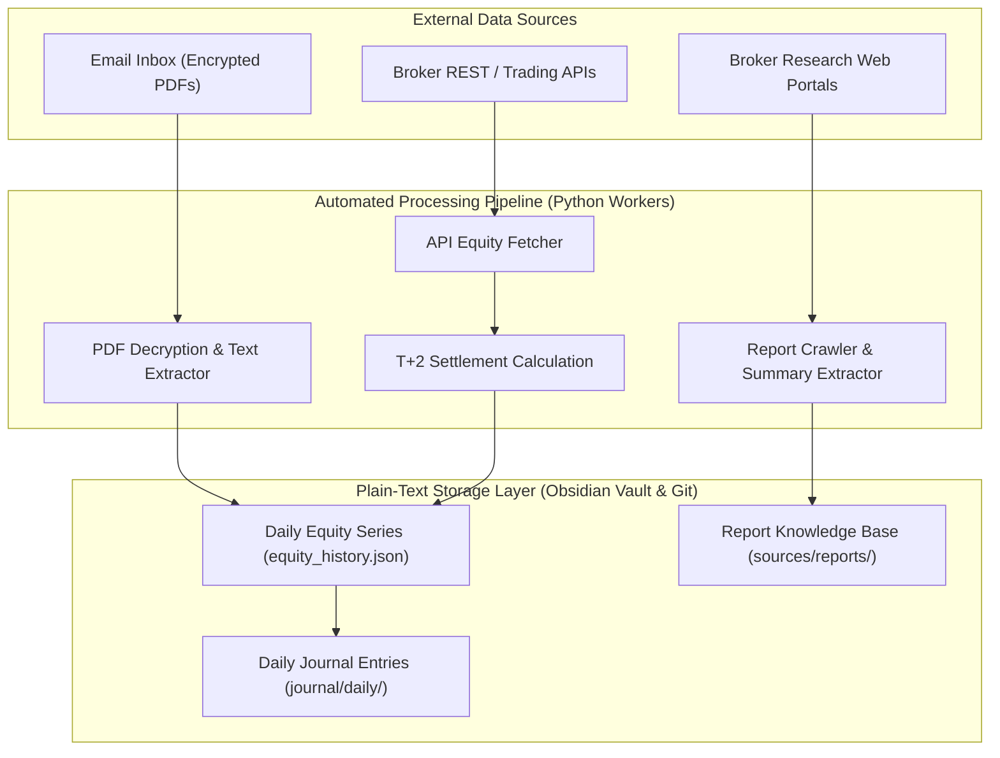
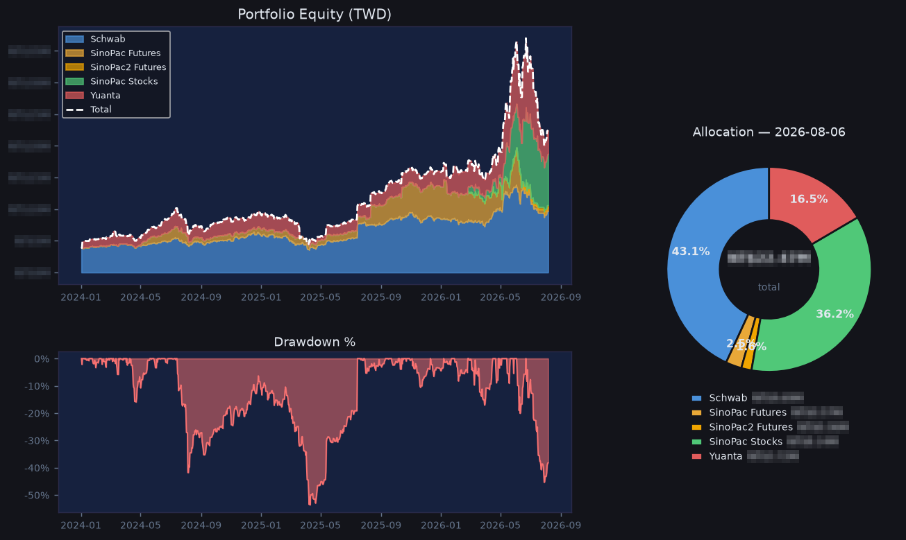
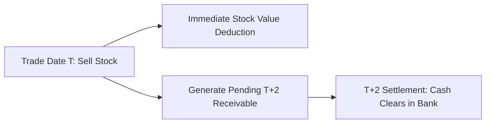

## Introduction

In building a Resident Assistant System, the primary engineering value is not how fluently a large language model chats, but whether it provides stable, precise, and uncompromised personal data and market intelligence.

When tracking investments and personal portfolios, we face two persistent manual pain points:
1. **Multi-Account Equity Fragmentation**: International brokerages, domestic futures, and stock accounts each live behind separate login interfaces or encrypted PDF emails. Manually logging into every platform daily is slow and error-prone.
2. **Market Report Information Overload**: Research institutions and brokerages publish numerous daily research notes and sector breakdowns. Without automated ingestion and structured indexing, these reports disappear into email noise.

To equip a resident personal assistant with trustworthy financial awareness and research capabilities, I built an automated pipeline using Python and Cron schedules: parsing encrypted daily PDF statements, querying brokerage APIs, calculating T+2 settlement adjustments, and crawling market research reports into a structured knowledge base.

---

## Architectural Overview

The automated tracking pipeline operates across two decoupled tracks: "Account Equity Calculation" and "Broker Research Report Ingestion":



The core principle: **Data ingestion, math, and storage run strictly via deterministic Python scripts; LLMs are reserved for downstream natural-language synthesis and query handling.**

Here is what the pipeline emits at 23:00 every day — three brokers, five accounts, with the equity curve, drawdown and allocation all assembled out of the statement PDFs and API responses described above:



The amounts are pixelated out, which leaves the part this post is actually about: the shape of the curve, the depth of the drawdown, the allocation split. That −53.6% drawdown in April 2025 is a real loss — the drawdown panel runs on time-weighted returns, so deposits and withdrawals are already stripped out of it. The green band that jumps in mid-June 2026 is a deposit into a new account, not a return. **On a chart the two look nearly identical, and the only thing that tells them apart is recording cash flows separately** — which is why the next section spends so long on T+2 settlement.

---

## Methodology Breakdown

### 1. Cracking the Black Box: Automated Parsing of Encrypted PDF Statements

Local futures brokers rarely provide open REST APIs for retail accounts. Instead, they email encrypted daily statement PDFs after market close.

To extract exact balance figures without relying on brittle OCR (which is slow and misreads numbers), I built a pure Python pipeline:
* **Inbox Monitoring**: Scheduled scripts scan the inbox for specific statement email subjects and download PDF attachments into isolated local staging folders.
* **In-Memory Decryption**: Python PDF libraries unlock the file using environment-based credentials without writing unencrypted files to disk.
* **Structured Text & Table Extraction**: Text extraction primitives locate exact target anchors (such as "Margin Equity" or "Net Account Value") and extract numbers via deterministic regular expressions.

This pure-code approach guarantees 100% numerical precision, eliminating OCR misread risks.

### 2. Handling T+2 Settlement Lags

When calculating total Net Asset Value (NAV) for stock accounts, I encountered a classic engineering pitfall: **The T+2 Settlement Lag**.

When stock is sold on day T, the shares leave the depository account immediately, but sale proceeds do not clear into the settlement bank account until day T+2. If NAV is calculated naively as `Bank Cash + Stock Market Value`, the portfolio value experiences a artificial drop on the trade date, followed by an artificial jump on T+2.



To eliminate artificial swings, the equity calculator applies a **Settlement Adjustment Formula**:
* `Total Account Value = Settled Bank Cash + Pending Receivables/Payables (T+1/T+2) + Current Stock Market Value`.
* Fetching pending settlement line items directly from the broker API maintains smooth, accurate NAV tracking throughout the settlement cycle.

### 3. Multi-Broker API Ingestion and Auto-Plotting

For brokers offering open REST or SDK endpoints, scripts periodically query current liquidation value and margin equity.

Every night after market close (e.g. 23:00), a consolidation job:
* Appends daily equity snapshots into local JSON history files.
* Invokes plotting modules to render multi-account equity growth charts.
* Formats net values and daily percentage changes into Markdown tables, automatically updating the daily journal entry.

### 4. Broker Research Ingestion & Knowledge Base Indexing

Beyond portfolio tracking, daily crawler crons:
* Scan and download research PDF reports from participating institutions.
* Extract target prices, rating changes, and core thesis summaries.
* Organize raw PDFs and Markdown summaries into local Vault folders indexed by ticker symbols and sectors, allowing the assistant to retrieve original PDF files instantly in chat.

---

## Production Optimization & Lessons

### 1. Never Substitute "Last Known Value" for "Today Data"

In early iterations, when an email was delayed or an API timed out, filling yesterday's figure as today's data led to undetected multi-day data stagnation. Fix: **Mark missing data explicitly (`Data Missing`) and emit log warnings** until backfilled.

### 2. Irregular Email Arrival Times

Statement delivery times vary (some arrive at 18:00, others at 21:30). To prevent missed runs, the scheduler employs a **4-Day Rolling Window Backfill**: every execution checks and fills missing statement data over the previous 4 days.

### 3. Safeguarding Against PDF Layout Changes

Brokers occasionally modify statement PDF layouts. To prevent parser errors from injecting corrupt numbers, the parser enforces **Reasonableness Boundary Checks**: if extracted equity shifts by more than a preset daily percentage threshold, persistence is blocked and an alert is raised for manual review.

---

## Worked Example: How Unsettled Cash Faked a −6.6% Crash

The T+2 section above describes a mechanism. I only added that mechanism **after it had already fooled me once**. Here is the day it happened, because it demonstrates this system's most dangerous failure mode.

On 9 July 2026 the cash-equities account rotated positions: two names sold, one halved, two bought, with net sale proceeds worth about 6.9% of account NAV. That evening the scheduled job posted **−6.61%** to Discord.

The account had barely moved. The formula at the time was:

```
NAV = settled cash (acc_balance) + market value of holdings
```

That looks reasonable, and the bug is the word *settled*. Sold shares leave the market-value side the instant they fill, but the proceeds do not reach the settlement bank account until T+2. On the evening of 9 July that money was in neither term. It was in flight, and the formula had nowhere to put it.

Querying the broker's `settlements()` endpoint showed it sitting exactly where you would expect: `T=2, settling 7/13`. Adding it back:

| Formula | Settled cash | Market value | Unsettled (T+1/T+2) | Day change |
|---|:---:|:---:|:---:|---|
| Original (wrong) | ✓ | ✓ | ✗ | **−6.61%** |
| Corrected | ✓ | ✓ | ✓ | **+0.25%** |

The corrected formula adds one term whose sign follows the trade direction — positive for incoming sale proceeds, negative for cash owed on purchases — so it also removes the mirror-image fake *spike* on buy days.

```
NAV = settled cash + Σ unsettled settlements + market value
```

The reason this correction is sound is that it is self-consistent across the whole cycle: when the proceeds clear, the unsettled term drops to zero while cash rises by the same amount, and NAV stays smooth end to end.

The part worth writing down is **why this was hard to catch**. A −6.61% day triggers no alarm — markets do fall 6%. The reasonableness check described above only stops numbers that are absurd on their face, the kind a broken parser produces; it cannot stop a number that looks entirely real. Nothing crashed, nothing logged, nothing turned red. The system simply told a quiet lie.

**In data engineering, the errors that raise are the cheap ones.** The expensive ones are those shaped exactly like a correct answer.

(Worth noting: accounts read through an API's liquidation value are immune to this entirely — that figure already accounts for unsettled activity. This trap belongs specifically to any account whose NAV you assemble yourself.)

---

## Conclusion

A trustworthy resident assistant rests upon **high-reliability, low-maintenance data engineering**.

By combining Python PDF decryption, multi-broker API queries, T+2 settlement adjustments, and plain-text Git Vault sweeps, we established an automated personal equity and research engine without exposing private keys or credentials.

---

## Reference

- **[Python pikepdf Documentation](https://pikepdf.readthedocs.io/)**: High-performance QPDF-based PDF manipulation and decryption library.
- **[pdfplumber Documentation](https://github.com/jsvine/pdfplumber)**: Precision PDF text, table, and layout extraction tool for Python.
- **[Python matplotlib Documentation](https://matplotlib.org/)**: Automated chart rendering and visualization.
