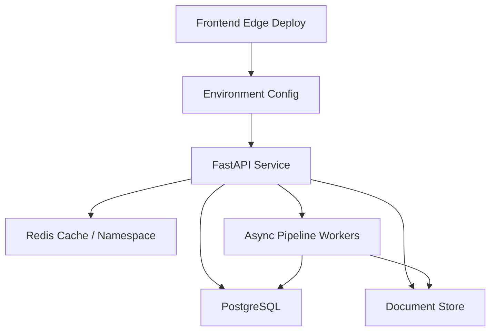

Many small teams and solo developers initially feel environment layering is over-engineered: if it runs locally and main deploys, that should be enough. Until these things happen for the first time:

1. A database migration succeeds locally, but production schema fields are different.
2. The frontend build passes, but deployment points the API base URL to the wrong environment.
3. OAuth flows, caching, CORS rules, and secret rotations cannot be genuinely tested locally.
4. Hotfix bug fixes and unverified next-version features get mixed into the same deploy path.

The value of Dev / Staging / Production is not making workflows look corporate, but isolating uncertainty in the right places. Dev is for rapid integration, staging is for simulating production, and production accepts only verified releases.

For a stack with React 19 + TypeScript + Vite frontend, FastAPI backend, Docker + Caddy + Redis infrastructure, and PostgreSQL / Firestore hybrid data layers, environment layering is a core engine of release velocity and operational quality.

---

## Architectural Overview

A concise and practical promotion path looks like this:

The point of this path is not having "more environments", but having each station answer distinct questions:

| Stage | Core Question | What to Verify |
|---|---|---|
| **Preview** | Can this PR build on its own? | Typecheck, Lint, Build, UI review |
| **Dev** | Does latest integration break existing features? | API contract, Migration execution, Smoke tests |
| **Staging** | Is the next release close enough to production? | Secrets, Cache, OAuth, Reverse proxy, DB connections |
| **Production** | Is the verified version healthy? | Health check, Error rate, Rollback target |

The full environment topology aligns multiple deployment tracks:

Environment separation is not about duplicating three sets of expensive infrastructure, but ensuring a release passes realistic checks before touching production.

---

## Methodology Breakdown

### 1. Bind Branch Strategy to Environment Strategy

If branches and environments have no formal mapping, deployment degrades into verbal agreements and manual steps. A reliable approach keeps the promotion path explicit:

Everyone understands: features go to preview, integration goes to dev, release candidates go to staging, and version tags promote to production.

### 2. Isolate Secret Boundaries Per Environment

The biggest trap in environment layering is "looking separate, but sharing secrets". The most dangerous sharing isn't code, but secrets, databases, and caches.

At a minimum, isolate:

- API base URLs
- OAuth callback URLs / allowed origins
- JWT or session signing secrets
- Redis namespaces or separate instances
- Database connection strings
- Object storage & document store folders
- Third-party API credentials

This is not aesthetic purity, but preventing test logins, dirty data, or cache keys from corrupting production.

### 3. Staging Must Resemble Production, Not Dev

Dev can be noisy, fast, and broken. Staging is different. Staging's sole job is to answer: "If I deploy this release right now, will it fail under production-like conditions?"

Therefore, Staging should duplicate Production's operational setup:

- Same reverse proxy configuration and HTTPS forwarding.
- Same Docker image build paths.
- Same secret loading mechanisms.
- Similar Cache-Control headers.
- Similar OAuth and CORS settings.
- Same database migration execution path.

Traffic scale can differ, but topology and risk vectors must match.

### 4. Health Checks Must Answer "Can It Serve?", Not Just "Is Process Alive?"

Simple `/health` endpoints returning `ok` provide little value for automated deployment verification. A practical health check verifies:

1. Can the API process respond to HTTP requests?
2. Is Redis accessible?
3. Can the database run basic queries?
4. What is the current Release Identity (Git Commit / Version Tag)?
5. What is the active Runtime Stage?

Health checks should never leak sensitive credentials. Their purpose is enabling CI/CD and operators to quickly judge service readiness.

### 5. Cache and CDN Policies Are Part of the Release

When frontends deploy to edge networks and backends use Redis caching, release design extends beyond container deployment. It must answer:

- Will new API response schemas be contaminated by stale cache?
- Does edge cache TTL cause version mismatches between frontend and backend?
- When should we rely on short TTL expiration vs. host-scoped purges?
- Do Redis keys include schema versions or environment namespaces?

These details become critical during breaking API contract changes.

---

## Production Optimization & Lessons

### 1. Consistent Env Variable Names, Inconsistent Value Meanings

Common pitfall: Dev and Staging both use `DATABASE_URL`, but Staging schema lags behind Production. Fix: Establish an **Environment Bootstrap Checklist** covering migration versions, test seeds, CORS origins, OAuth callbacks, Redis namespaces, and worker concurrency bounds.

### 2. Staging Degrading into Another Dev

If Staging uses different reverse proxies, cache headers, or auth configs, it fails to predict Production breakage. Staging doesn't need production traffic, but deployment topology, API gateways, cache policies, and secret loading should match.

### 3. Production Deploys Lacking Release Identity

Version tags or release IDs define clear, traceable boundaries. When error rates spike, you must quickly identify:
1. What version is running in Production right now?
2. Which commit corresponds to this release?
3. How does it differ from the last healthy release?
4. What tag is the rollback target?

### 4. Ignoring Non-Production QA Login Flows

When apps rely on OAuth, automated E2E tests often fail at real third-party login UI walls. A practical fix is providing a **non-production-only bypass login endpoint** protected by dedicated secrets, environment checks, and strict production guardrails.

### 5. Equating Deployment Success with Release Success

Deployment is placing code onto servers; a release includes health checks, error rate monitoring, asset loading checks, API smoke tests, cache verification, and rollback plans.

---

## Visual Plan

### Figure 1: Branch-to-Environment Promotion Path
* **Purpose**: Show how code advances safely into Production.
* **Placement**: Section 1 (Architecture).
* **Caption**: `Environment layering is about proving readiness at every promotion step.`
* **Inspiration**: Vercel / GitHub transit-map style workflows.

### Figure 2: Three Environments Comparison
* **Purpose**: Visualize roles of Dev, Staging, and Production.
* **Placement**: Section 2 (Methodology).
* **Caption**: `Dev finds integration issues, Staging finds release issues, Production accepts verified code.`
* **Inspiration**: Stripe Technical Blog three-column architecture breakdown.

---

## Conclusion

Dev / Staging / Production layering is not corporate overhead, but a practical risk-reduction pattern. It channels problems effectively:

1. **Dev catches integration issues.**
2. **Staging catches release issues.**
3. **Production receives only verified code.**

Start with a clear promotion path: Code to Preview, Dev integration, Staging validation, and Version Tag releases to Production.

---

## Reference

- **[GitHub Actions Deployments and Environments](https://docs.github.com/en/actions/reference/workflows-and-actions/deployments-and-environments)**: Understand environment secrets, deployment protection rules, and variable scopes.
- **[Cloudflare Pages Documentation](https://developers.cloudflare.com/pages/)**: Edge frontend deployment, Git integration, and static asset distribution.
- **[Docker Compose Documentation](https://docs.docker.com/compose/)**: Managing multi-container application lifecycles.
- **[Caddy Reverse Proxy Guide](https://caddyserver.com/docs/quick-starts/reverse-proxy)**: Reverse proxy and HTTPS automated certificate setups.
- **[Redis Caching Solutions](https://redis.io/solutions/caching/)**: Cache-aside patterns for read-heavy workloads.
