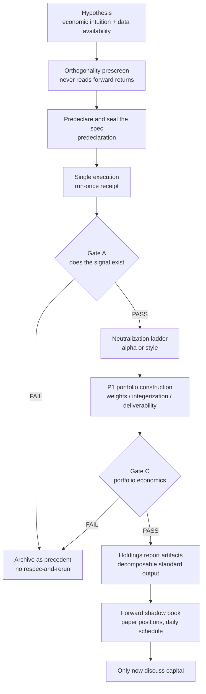
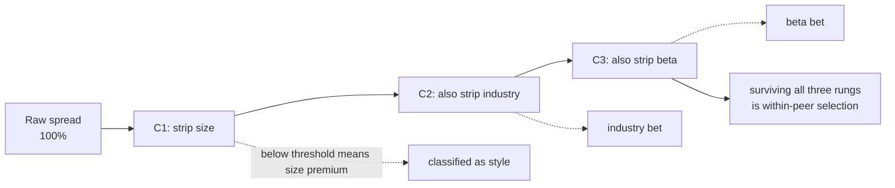

> This post is about **research process and engineering discipline**. It is not investment advice, and it contains no directly tradable signals, parameters, or instruments. Every performance-related statement here is an illustrative range or a directional description, not an actual number.

## Introduction: the real adversary is not a weak model, it is me

In my first few months of quantitative factor research, the pattern went like this: produce a pretty equity curve, get excited, wake up the next day thinking "let me try a different lookback window," get a prettier one, change the ranking scheme, get prettier still. By the time I stopped, nobody — including me — could say whether the curve was the signal's doing or the best of twenty attempts.

Academia has a name for this: **researcher degrees of freedom**. As long as you can still adjust the specification *after* seeing results, your p-value, your Sharpe, and your out-of-sample all stop meaning anything. And the degrees of freedom in quantitative research are astronomical — signal definition, universe, rebalance frequency, position count, weighting scheme, cost assumptions, sample cut points. Every one is tweakable, and every tweak can "improve things slightly."

What I eventually understood: **this is not a modeling problem, it is an internal controls problem.** Trading needs risk management, code needs review, and research needs a system that governs the researcher. This post records the system I have actually run for more than a year — and have actually violated a few times myself. It does not guarantee profit. It only guarantees that when a result is fake, I can see it.

So far the process has kept the large majority of twenty-odd candidate factors outside the door. That sounds unrewarding, but each rejection is capital that never went in.

---

## Architectural Overview: a one-way pipeline from hypothesis to live observation

The most important property of the whole process is that it is **one-way**: each stage only moves forward, never re-runs backwards. Any move backwards must leave a record.

A few boundaries I drew deliberately:

| Boundary | Owner | Why it is separated |
|---|---|---|
| Research ↔ delivery | Research emits target holdings; delivery (notifications, dashboards) only displays | The moment delivery may re-sort or split orders, the research conclusion is no longer the thing that was validated |
| Backtest ↔ shadow book | The shadow book is a separate schedule with a separate artifact directory | Backtests can be re-run, forward records cannot; mixed together, the forward record gets contaminated |
| Spec ↔ parameters | Spec constants are hardcoded, **not exposed as CLI flags** | Anything tunable from the command line will be tuned at 3am |

That last one is the small design choice I recommend most. Making leverage, position count, and entry/exit thresholds into command-line flags looks like good engineering; in practice it turns researcher degrees of freedom into a convenient dial. Turn them into constants that require a code change and a commit, and the cost rises instantly — the abuse disappears.

---

## Methodology Breakdown

### 1. Predeclaration: the foundation of the whole system

Before running any formal test, I write a specification document and commit it. It contains: signal definition, universe, rebalance frequency, position count, weighting scheme, cost model, sample period and out-of-sample cut point, **and the reasons I expect it to fail**.

Six rules, all of them hard:

1. **Freeze the spec before running.** Reverse the order and the test has no force.
2. **Run once.** No "let me try another lookback," no running until it looks good.
3. **FAIL is a fully valid, expected outcome.** Do not soften the language, do not flip the signal, do not rescue a failed factor by folding it into a composite.
4. **Never re-cut out-of-sample to improve a result.** Changing the evaluation window is only legitimate when decided before seeing new numbers and applied to every factor identically.
5. **Keep the failed artifacts.** They are the record.
6. **Execution receipts must never be deleted.** Each run acquires a run-once receipt, created *before* the program reads any forward returns. A genuine rerun (say the program crashed before touching returns) must overwrite it with a stated reason, and the old content is nested inside the same file. **Deleting a receipt leaves no trace, which makes it the most serious violation.**

Rule 6 came after being burned. I initially thought self-discipline was enough; the problem with self-discipline is that it leaves no evidence — three months later I could not remember whether a factor was on its first run or its third. The receipt turns "I remember" into "it is in the file."

### 2. Orthogonality prescreen: the only checks allowed before sealing

One class of check is safe: **it never reads forward returns.** With no result to peek at, it cannot contaminate the later test and cannot tempt a spec change.

I always do two things:

**(a) A cross-sectional correlation matrix against incumbent factors.** Daily cross-sectional rank correlation, masked to the intersection of names both factors can actually score that day — computing correlation on names one factor cannot rank measures coverage differences, not differences of opinion.

The reading rule: correlation ≥ 0.7 against an incumbent means it is **not a new dimension**. Whether or not it passes Gate A, it cannot be used as a diversification argument. I also write down my expected correlation in the predeclaration and compare afterwards.

**(b) Tail discrimination.** The most underrated check, in my view. Rank IC is computed across the whole cross-section, but a portfolio that only buys the top N lives exclusively in the extreme. If a factor saturates in the tail (a mathematical ceiling, dozens of names tied above 0.99), it can post the highest IC in the whole program while being completely untradeable — because the top ten are effectively drawn at random from a tied clump.

The test is simple: the gap between the best name and the Nth name, as a share of the full cross-sectional range. A healthy factor puts that in the double-digit percentages; a saturated one drops to single digits.

Something else I learned here: **a saturated factor cannot be rescued by switching to threshold screening.** That only replaces a saturated ranking with no ranking at all.

### 3. Gate A: does the signal exist at all

Gate A judges exactly one thing: does the signal have predictive power. It does not judge whether money can be made — that comes later.

I use a set of checks that must all pass:

| Check | My threshold | What it catches |
|---|---|---|
| Mean out-of-sample rank IC over expanding walk-forward windows | > 0 | Direction |
| Fold stability (IC leg **or** spread leg) | Either leg ≥ 70% of out-of-sample folds positive | Stability, not strength |
| Quantile monotonicity | Broadly monotonic, not just a good top bucket | Whether it rides on tail luck |
| Coverage / turnover / period decay | Must not be driven by a few dates or a few names | Concentration risk |
| Long-short spread after a cost proxy | Still positive | Gross is not net |
| Data timing for fundamental factors | Must align to **actual announcement timestamps**, never a filing-deadline proxy | Look-ahead bias |

The second row deserves its own paragraph, because I misread it once and produced a wrong conclusion.

The threshold says "the larger of the two legs ≥ 70%" — compute the share of positive folds for the IC leg, compute it for the spread leg, take the larger and compare to 70%. It is **not** "the share of folds in which at least one leg is positive." That is a completely different and always larger number: a fold with negative IC but positive spread counts toward the latter while counting for neither leg.

Using that second reading, I once turned a 66.7% / 66.7% factor (both legs failing) into 77.8% (passing). The difference is fail versus pass. **Ambiguity at the level of definitions is far more dangerous than a modeling error, because it never raises an exception.**

A related note: this threshold is OR, not AND. A single-leg pass still counts as a pass, but I annotate it as "single-leg" in the record, because it is materially weaker than both legs passing.

### 4. The neutralization ladder: separating alpha from style

This is the most valuable stage of the whole process, and in my experience the least commonly run.

A factor's return can come from two entirely different things:

- **Selection (alpha)**: picking names that beat their peers within the same group.
- **Exposure (style)**: the portfolio systematically tilting toward a characteristic — small caps, an industry, high beta.

Both are real money, but **their risk character, their capacity, and what makes them break together are completely different**. And the second kind you do not need to research at all — just hold the exposure directly, far more cheaply.

My approach is to regress the signal cross-sectionally against a set of controls each day, rebuild the portfolio from the residual, and see how much spread survives:

In practice this stage kills more candidates than Gate A, and the ways they die are instructive:

- One candidate **passed all eight mechanical checks** and was the strongest non-incumbent at the time — after stripping size, only about thirty percent remained, and most of that was industry. It was a well-packaged small-cap premium.
- Another came through the size rung nearly untouched and died on beta. "It is not a small-cap bet" and "it is alpha" are two different claims.
- One candidate held up on the ladder better than the incumbent — but its spread was smaller than the incumbent's to begin with. **More neutralization-resistant but weaker** is not an upgrade.

### 5. The most counterintuitive lesson: correlation in signal space does not predict survival in return space

I guessed wrong five times in a row before accepting this as a rule rather than a coincidence.

The correlation from the prescreen lives in **signal space**: how similar two rankings are. The neutralization ladder measures **return space**: whether the return can exist independently of those exposures. I assumed the former would predict the latter — if a signal has near-zero correlation with size, surely it is not a size bet?

Measured:

| Candidate | Signal correlation vs size | Spread retained after stripping size |
|---|---|---|
| A | −0.07 (nearly orthogonal) | Only 17% (almost entirely size) |
| B | −0.04 (nearly orthogonal) | 85% retained (genuinely not size) |
| C | +0.13 (weakly positive) | Only 30% |

Three times, wrong in both direction and magnitude. The conclusion is hard: **low correlation is a necessary condition, not a sufficient one; only the ladder can adjudicate, never the correlation matrix.** I have also seen a factor almost perfectly orthogonal to every incumbent whose problem was having no predictive power at all. Orthogonal and empty is a very common state.

What I do now: still write the prescreen prediction into the predeclaration and still compare afterwards, but use it **only to decide whether the shot is worth taking, never to draw a conclusion.** Turning "I assumed" into an auditable record calibrated my trust in my own intuition remarkably fast.

### 6. Two side tracks: admit reality instead of moving the standard

Run the system long enough and two awkward situations appear. My response is not to loosen thresholds but to open two clearly labeled side tracks.

**(a) The style track — hold the style exposure in the open.**

The eligible set is very narrow: candidates that pass every mechanical check and die **only** on the neutralization ladder. Not one word of the signal spec may change (changing it makes a brand-new candidate that walks the whole path again). What it must pass is not the original gate but a style report card targeting three known failure modes:

1. **No selection value** → build a placebo portfolio from the *fitted values* of the same regression rather than the residual. If the placebo reproduces the original return, you do not need this factor; you need to hold that exposure directly.
2. **Not deliverable** → leg-by-leg liquidity of the actually selected names, cost stress tests, and break-even cost.
3. **Redundant with the existing book** → return correlation and holdings overlap.

Only if it trips none of the three does it get classified as a **declared** style portfolio. Note the wording: *declared*. It is not alpha, and the documentation says so permanently.

**(b) The exploration track — when a window of history has been used up.**

By the twentieth-odd study I had to face something honestly: I had looked at the same stretch of history twenty-odd times, and claiming "this is a clean out-of-sample test" was self-deception. The family-wise error rate had become unquantifiable.

The response is to replace the system rather than keep pretending:

| | Main track | Exploration track |
|---|---|---|
| Role of the historical window | Out-of-sample test | **Development sample**; iterate freely, flip signals freely |
| Integrity mechanism | Per-run predeclaration + run-once receipt | **Append-only trial registry**: every evaluation (spec hash, full spec, all check numbers) lands before it is reported |
| What historical results prove | Passing makes it a candidate | **Nothing**; they can only rank |
| Promotion condition | Pass Gate C | Freeze the spec, then **only forward data development never touched** can pass |

In other words: swap a single predeclaration for a complete search log, then swap historical out-of-sample for a gate only future data can clear. Delete or filter the registry, and the whole family loses eligibility.

### 7. Gate C: portfolio-level economics

A signal existing does not mean a portfolio can live. Gate C asks a completely different set of questions:

- Post-cost out-of-sample Sharpe ≥ 0.7
- **No single year contributing more than 50% of total P&L**
- Maximum drawdown ≤ 20%
- Alpha still present after integer projection (the share and contract counts you can actually buy)
- Position, beta, and industry residuals all inside constraints

The second bullet is my most common cause of death here, far more common than an insufficient Sharpe. A portfolio with a decent five-year Sharpe often turns out to be "one year made it all, four years went sideways" — that is not a strategy, that is one lucky timing event smeared across an average.

The fourth deserves its own note: **alpha that holds under continuous weights and vanishes under integer projection cannot be promoted.** Continuous weights describe a portfolio nobody can buy. My rule now is that any backtest producing holdings runs integer projection by default, not as an option. (I measured the impact once and it was "immaterial" — but **"immaterial" is a measurement, not a permit to skip it**, and every portfolio must measure it for itself.)

Two more things about costs, learned the expensive way:

- **The cost model is asymmetric.** In my market, sells pay tax and buys do not; using one number for both systematically overstates results. And different instruments (cash equities, derivatives) have structurally different cost models that cannot be shared.
- **A minimum commission is a capital floor, not loose change.** A wide portfolio holding two hundred-plus names, at small capital, loses most of its edge to per-order minimums alone; scale the same portfolio up and that drag falls to a fraction. **Portfolio breadth and capital size are one coupled design decision**, not two.

### 8. Holdings reports: a total return nobody can decompose is not a result

I once had a backtest report showing an extremely high cumulative return sitting there for days, and nobody — me included — could answer whether it was the signal's doing or four stocks during one unusual period. Since then I have a hard rule: **any backtest that produces holdings must emit a complete set of standardized renderable artifacts.**

Written through a shared writer, never hand-assembled. Contents:

- The equity curve **on a log scale**, overlaid with an equal-weight universe benchmark. A linear axis flattens the first three years into a straight line; a log axis makes equal vertical distance mean equal multiple. When a leveraged strategy faces an unleveraged benchmark, you compare **shape**, not height.
- Per-name holdings: share/contract counts, weights, and entry/exit actions (new, exited, held with adjustment, held untouched) — so costs can be attributed line by line.
- Concentration decomposition: largest single-name contribution, largest single-period contribution, contribution by year.
- Cost detail: modeled costs, minimum-commission overlay, realized turnover.

The most valuable design in that writer is deeply boring: **it validates the schema at write time.** A missing field or drifting structure raises at the moment the data is produced, naming the field — replacing the failure mode where someone tries to render a report weeks later and gets an incomprehensible error deep inside the renderer.

### 9. The shadow book: paper positions, run with production-grade specs

Passing the gates still does not touch real money. The next stop is a **forward shadow book**: a scheduled job produces a complete target holdings list every day, records it, and then time passes.

My design principles for shadow books:

- **Daily schedule, idempotent.** On non-rebalance days it prints "not due" and exits cleanly. Catching up after a few days offline is safe.
- **State is a pure function of history.** One of my books keeps no state file at all: every run replays from day one and compares against a frozen engine, refusing to write on a mismatch. There is no state to corrupt or desynchronize, and a missed week self-heals on the next run.
- **The ledger is built only from recorded books, never from a live replay.** That way later data revisions cannot quietly rewrite the forward record.
- **Artifacts stay out of version control.** Positions are never committed.
- **Any spec change (signal, lag, schedule, size, caps) restarts the evaluation clock**, and goes into an amendment log. Changing something and keeping the old observation period means having no observation period.
- Evaluation criteria must be **written in advance**: how many trading days to observe, and what to check (directional consistency, whether realized costs land inside the model's tolerance, whether the book can actually be formed each time it should be).

That last one reads like a truism, but I once launched a book before writing the criteria. The result was that it diligently accumulated a record **nobody had committed to interpreting in any particular way**. That is worse than no record, because it makes you believe you are validating something.

---

## Production Optimization

All of these are real, ordered by how much they hurt.

**1. Merged is not deployed.** My daily schedule runs from a separate clone that tracks the mainline on its own update cadence. Edit the scheduled script, pass CI, merge to main — and the schedule is still running the old code. CI can never see this, because the schedule is not in CI. My rule now: after merging, go pull that clone, **trigger a real scheduled run manually, and read the log to the end**. Without reading the log, the deploy is not finished.

**2. Mixing full-sample and out-of-sample numbers.** The diagnostic tool computes concentration on the full sample while the document quotes out-of-sample, and the two can differ by several percentage points. I once wrote up a candidate as "twice the concentration of the incumbent"; recomputed on the same window it was 1.6x. Now every number carries its window label as part of the documentation standard.

**3. The deliverability wall: continuous-weight alpha meets what you can actually buy.** I had a genuinely orthogonal, genuinely passing factor die because almost all of its edge came from illiquid small names, and the portfolio simply could not be assembled from the instrument set available to me. Worse, in certain market states the eligible names dropped to single digits, so even the smallest portfolio could not be formed. This is not a defect in the signal; it is a **structural constraint of the instrument set** — but the outcome is the same: alpha you cannot trade is zero. Which is why deliverability checks belong *before* you compute a beautiful expected return, not after.

**4. An unstated objective function produces contradictory conclusions.** I tested a risk control mechanism that lost when scored on total return and won when scored on max drawdown plus Sharpe. Same experiment, same data, opposite conclusions. That is not a data problem; it is my failure to write down what I was maximizing beforehand. Every predeclaration now carries a decision-criterion line.

**5. Costs belong at the front, not the end.** Several factors with positive gross edge went outright negative after costs — not marginal, flipped. My order now: a cost proxy already at Gate A, and a precise, per-instrument, asymmetric model at Gate C. Adding costs last means the preceding weeks studied a world that does not exist.

**6. The default assumption about concentration should be bad.** For a newly built portfolio, assume returns are concentrated in a few years and a few names until proven otherwise. I have seen a book where the top ten names contributed more than half the P&L and a single name nearly twenty percent. No automatic threshold catches this — because that book's Sharpe looked good. **A checklist cannot think of what you did not put on the checklist**, so every result document carries a "known fragilities" section for risks no threshold is watching.

**7. Do not treat "probably harmless" as harmless.** The integer projection impact mentioned above, modeled stop-loss estimates that skew conservative or optimistic, dividend taxes, fill probability on odd lots — I mark all of these as *unmodeled* rather than *immaterial*. The difference: unmodeled is a debt on the books; immaterial is a conclusion with no evidence.

---

## Conclusion

If the process needs a name, I would call it **predeclare → gate → shadow**: seal the spec so degrees of freedom go to zero, eliminate through independent gates that each ask a different question, and let time itself be the final judge.

A few takeaways that transfer directly to other domains:

1. **A dial that can be turned will be turned.** Moving research parameters from command-line flags into version-controlled constants was the highest-ROI refactor I have done.
2. **A rerun that leaves no trace is more dangerous than the rerun itself.** Run-once receipts, append-only registries, amendment logs — none of them exist to prevent you from re-running; they exist to guarantee the re-run is visible.
3. **Correlation answers "are they alike," not "can it survive."** Those are two different questions requiring two different instruments, and my intuition is unreliable on the second one.
4. **Untradeable alpha is zero, so move deliverability forward.** Putting delivery checks before return estimation saves a large amount of wasted work.
5. **A forward record with no evaluation criteria is expensive self-comfort.** Before starting observation, freeze how long and by what standard it will be judged.
6. **FAIL is output.** The overwhelming majority of what this system produces is "this path is closed," and every archived failure spares the next proposal from walking the same road. That is where research capital actually accumulates — not in the pretty curve.

---

## Reference

- **[False-Positive Psychology (Simmons, Nelson & Simonsohn)](https://journals.sagepub.com/doi/10.1177/0956797611417632)**: The original source of the "researcher degrees of freedom" concept and the theoretical basis for the predeclaration system here.
- **[…and the Cross-Section of Expected Returns (Harvey, Liu & Zhu)](https://doi.org/10.1093/rfs/hhv059)**: Matches the "family-wise error rate is unquantifiable" section — once a field has tested hundreds of factors, single-test significance levels stop meaning anything.
- **[Pseudo-Mathematics and Financial Charlatanism (Bailey & López de Prado)](https://www.ams.org/notices/201405/rnoti-p458.pdf)**: Matches the used-up-window problem in section 6, and why the gate has to move to forward data.
- **[A Taxonomy of Anomalies and Their Trading Costs (Novy-Marx & Velikov)](https://www.nber.org/papers/w20721)**: Matches "costs belong at the front" — a large body of academic anomalies disappears once realistic trading costs are applied.
- **[Center for Open Science — Preregistration](https://www.cos.io/initiatives/prereg)**: The mature version of predeclaration in other disciplines; my specification format borrows heavily from its field design.
- **[MSCI Factor Models](https://www.msci.com/our-solutions/analytics/factor-models)**: Matches the neutralization ladder — decomposing returns into style exposure and residual is standard risk-model practice, not something I invented.
