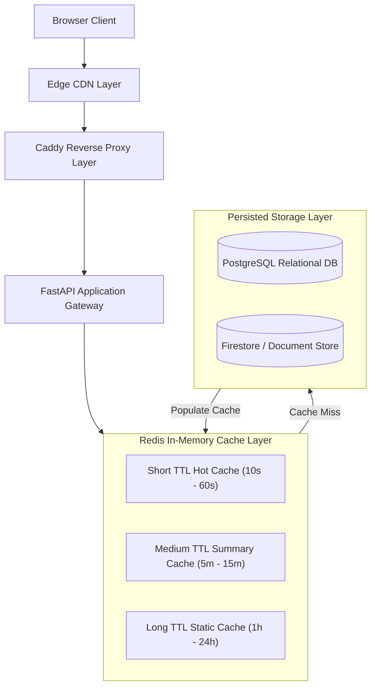
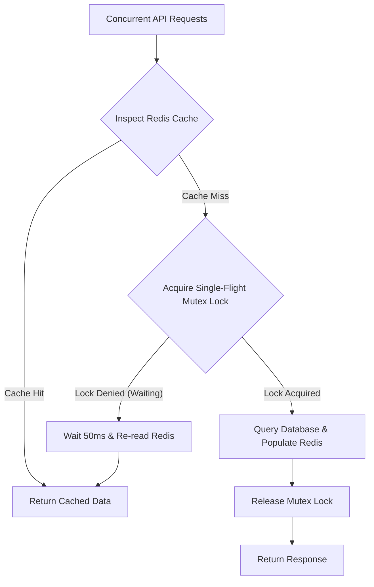

## Introduction

When building high-concurrency, read-heavy full-stack web applications, one of the most common mistakes engineering teams make is adopting a one-size-fits-all approach to caching: either avoiding caching entirely, or applying a single fixed expiration time (e.g. TTL = 5 minutes) across every endpoint.

In production environments, data freshness requirements vary dramatically:
* Real-time market ticker data changes second by second.
* Generated podcast summaries and financial reports tolerate several minutes of caching.
* Static domain vocabularies and sector taxonomy graphs may not change for days or weeks.

Routing all requests straight to persistent databases quickly exhausts connection pools during traffic spikes. Conversely, naive caching strategies introduce Cache Stampedes, data inconsistency, and memory exhaustion.

In this post, I want to share our methodology for tiered caching using FastAPI and Redis, explaining how to partition cache boundaries by read characteristics and guard against production cache storms.

---

## Architectural Overview

A robust high-performance cache architecture relies on a multi-tier defense pipeline spanning from client browsers down to databases:

The core principle centers on the **Cache-Aside Pattern** combined with **Freshness-Tiered Invalidation**:
* **Tier 1 (Edge & Browser)**: Employs `Cache-Control` and `s-maxage` headers to intercept repetitive GET requests at the edge network.
* **Tier 2 (Redis Cache-Aside)**: FastAPI inspects Redis first. On a hit, it returns cached JSON immediately; on a miss, it queries the database, populates Redis, and returns the response.
* **Tier 3 (Persistent DB)**: The database processes true cache misses and write transactions only, remaining isolated from read traffic pressure.

---

## Methodology Breakdown

### 1. Partitioning the Cache TTL Matrix by Data Freshness

Not all APIs deserve the same TTL. In practice, I classify endpoints into three distinct tiers:

| Cache Tier | Data Type Example | Recommended TTL | Cache-Control Header Strategy |
|---|---|---|---|
| **Short-lived** | Live market ticker feeds, active task statuses | 10s - 60s | `public, max-age=10, s-maxage=60` |
| **Medium-lived** | Episode summaries, report text, key insights | 5m - 15m | `public, max-age=60, s-maxage=900, stale-while-revalidate=30` |
| **Long-lived** | Sector taxonomy, domain vocabulary, ticker metadata | 1h - 24h | `public, max-age=3600, s-maxage=86400` |

This matrix reduces database read load by over 90% while guaranteeing necessary freshness.

### 2. Guarding Against Cache Stampedes (Thundering Herd)

When a hot cache key expires while hundreds of concurrent requests hit the API simultaneously, every request observes a Cache Miss and queries the database concurrently. This is the **Cache Stampede (Thundering Herd)** problem, which easily crashes database connection pools.

We deploy two key engineering defenses:

* **Single-Flight Mutex Lock**: On a Cache Miss, the first worker requests a short-lived mutex lock in Redis. Only the worker holding the lock queries the database; competing requests pause briefly and re-read Redis. This guarantees the database handles exactly one query during spikes.
* **Probabilistic Early Expiration (XFetch Algorithm)**: For extreme hot keys, the system probabilistically triggers background asynchronous revalidation during the final 10% of a key's TTL, refreshing the cache seamlessly.

### 3. Namespace Hierarchy and Versioned Cache Keys

Unstructured cache key naming risks stale cache format contamination across deployments.

I use a structured namespace template:

`{environment}:{domain}:{entity_type}:{version}:{entity_id}`

Benefits:
- **Environment Isolation**: `prod:market:ticker:v1:2330` and `staging:market:ticker:v1:2330` are fully isolated.
- **Breaking Change Protection**: When backend schemas update, incrementing the version fragment to `v2` bypasses legacy formats cleanly without flushing the entire Redis database.

---

## Production Optimization & Lessons

### 1. Eliminating Serialization CPU Overhead

In early iterations, converting ORM objects to dicts, serializing to JSON strings for Redis, and deserializing back into Pydantic models introduced CPU bottlenecks under high concurrency.

**Optimization**: Store pre-serialized JSON strings directly in Redis. In FastAPI, return raw `Response(content=cached_bytes, media_type="application/json")` to bypass Pydantic model validation entirely, reducing response latency to single-digit milliseconds.

### 2. Eviction Policies and Large Key Pitfalls

Redis operates in memory. Without explicit `maxmemory` limits and appropriate eviction policies (e.g., `volatile-lru`), memory spikes cause the OS OOM killer to terminate Redis.

Avoid storing oversized JSON payloads in a single key. Large keys block the single-threaded Redis event loop during reads and deletions; break large blobs into smaller keys or Hash structures.

### 3. Monitoring Cache Miss Anomalies

Without cache metrics, caching failures stay hidden. If a code regression alters cache key formats, the system experiences 100% cache misses silently until the database collapses.

Track observability headers (`X-Cache: HIT` / `X-Cache: MISS`) and log hit ratios to alert when cache hit rates drop below target baselines (e.g., Target > 85%).

---

## Visual Plan

### Figure 1: Tiered Cache Defense Line
* **Purpose**: Show request filtering across Browser, Edge CDN, Redis, and DB.
* **Placement**: Section 1 (Architecture).
* **Caption**: `Request filtering pyramid: Edge CDNs intercept repetitive queries; Redis serves dynamic reads.`

### Figure 2: Single-Flight Mutex Locking
* **Purpose**: Visualize how Single-Flight locks protect databases during Thundering Herd events.
* **Placement**: Section 2 (Methodology).

---

## Conclusion

Cache engineering goes far beyond calling `redis.set`. It is a system for **data freshness management, boundary isolation, and failure defense**.

By tiering FastAPI and Redis:
1. **Partitioning TTL matrices by data freshness**.
2. **Deploying Single-Flight locks against Cache Stampedes**.
3. **Structuring versioned key namespaces**.
4. **Bypassing redundant serialization overhead**.

This architecture maintains single-digit millisecond latencies and database stability under traffic surges.

---

## Reference

- **[Redis Caching Strategies & Best Practices](https://redis.io/solutions/caching/)**: Guide to Cache-Aside, Write-Through, and Read-Through patterns.
- **[FastAPI Official Documentation](https://fastapi.tiangolo.com/)**: Async routing and custom response design.
- **[MDN Cache-Control Guidelines](https://developer.mozilla.org/en-US/docs/Web/HTTP/Headers/Cache-Control)**: Specifications for max-age, s-maxage, and stale-while-revalidate.
- **[Optimal Probabilistic Cache Expiration (XFetch Paper)](https://vldb.org/pvldb/vol8/p886-vattani.pdf)**: Research on early cache expiration algorithms.
