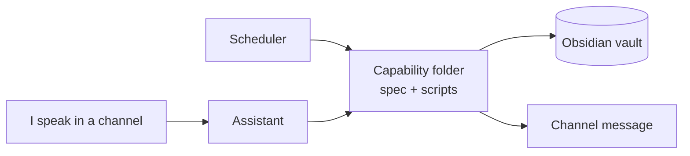
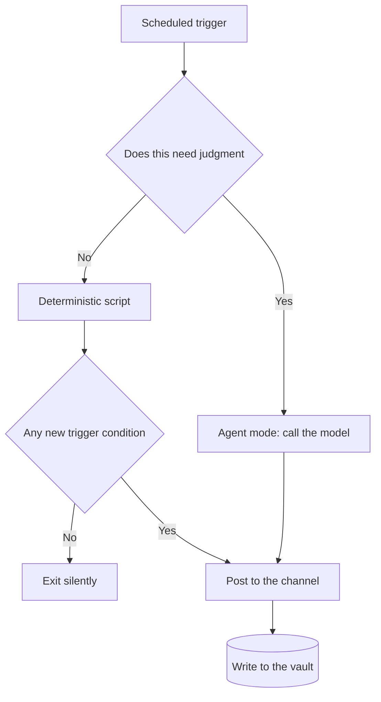

To be clear up front: this is a personal setup I actually use. It is not a product and it is not becoming one. What I want to record here is what changed in the design once I stopped treating it as "a bot that answers questions" and started treating it as "something resident in the background with a schedule of its own".

A chatbot exists because you opened it. You open a window, ask something, close it, and it is gone. This is the opposite: it runs continuously, and most of what it says to me on a given day is not an answer to anything I just asked. It picked the moment.

That sounds like it amounts to "plus a scheduler", but building it out, the difference rewrites the whole priority order of the design.

---

## What it actually is

Physically, it is boring: a small always-on machine at home running two things — a gateway connected to Discord, and a scheduler. Next to them sits an Obsidian vault — a pile of Markdown files in a git repo — which is its long-term memory.

What I receive on a normal day is roughly: summaries around the market sessions, a record of a few account balances, the day's log, and alerts when the system itself breaks. The specifics do not matter. What matters is that I did not ask for any of it in the moment.

Below are the six traits that, to me, are what stop it from being a chatbot, in order of how much they matter.

---

## 1. Resident and proactive: it picks the moment, not me

This is the root difference, and the other five hang off it.

Once an assistant can speak first, "what should it say" stops being the hard problem and "when should it say it" becomes the hard problem. And that one cannot be solved by a model — it is a question about my day, not about language.

I eventually turned it into a hard rule: **a notification must satisfy both "I am awake" and "the window is still open", otherwise it does not get sent**. An analysis that arrives after the session has closed is information, however complete, not action. That rule alone killed several jobs that looked useful but landed at a time nobody could act on.

The flip side is that the assistant needs "say nothing" as a first-class option, treated as a normal outcome rather than an error.

---

## 2. It lives in Discord: no new surface

I built no app, no dashboard, no web UI. It speaks inside the Discord I already have open every day.

That is the real reason it survived past week two.

Any interface that requires me to go and open it eventually becomes an interface I do not open. Discord is already open, messages already push to my phone, history is free, and multi-device sync is not my problem. I effectively got a notification system, an inbox, and an archive for nothing.

The cost is accepting the medium's constraints — message length, limited formatting, no interactive components. But those constraints pushed every message down to "one glance tells me whether to look closer", which for something that speaks a dozen times a day is an improvement, not a limitation.

---

## 3. Channels are roles: routing, memory scope, and persona are one decision

I use Discord channels as the routing table for the entire system.

One channel, one role, one prompt, one destination folder. Market questions, research, engineering, report feeds, system alerts — each has its own channel, its own persona and data access, and its output lands in its own folder in the vault.

This solves three things at once: I never have to explain the current context (the channel is the context), the assistant never has to guess where a conversation should be filed (the channel decides), and when I want to change one role's behavior I edit one isolated prompt without touching the others.

I later added a classification on top: channels are either **interactive** (I talk in them), **feeds** (one-way into me, I never talk there), or **engine** (they trigger long-running computation). Once that split existed, several homeless features found an obvious home — and two or three channels got merged out of existence because their responsibilities overlapped.

---

## 4. Capabilities are folders, with two entry points

Every capability the assistant has is physically a directory: one spec file describing what it does and when to use it, plus a few scripts.

The important part is that **the same script has two callers**: the scheduler can invoke it at 8:30am on its own, and I can invoke it directly from a chat message. Both run the same code. There is no "scheduled version" drifting apart from an "interactive version".

It sounds obvious, but it removes a whole class of problems. Capabilities living on the filesystem means they are version-controlled, diffable, and runnable locally in isolation for debugging — and there is no invisible configuration hiding in a runtime registry that only exists once the service is up. To know what this assistant can do, I `ls` a directory.

---

## 5. Memory is plain text

Everything it learns, produces, and records ends up as Markdown files in a git repo. I open them in Obsidian, grep them, and edit them by hand.

The assistant and I read and write the same store — which matters far more than which database it uses. A summary it writes today, I can edit tomorrow; a note I write by hand, it can read back as context later. No import, no export, no format conversion in between.

To keep that from falling apart with two writers, I added exactly two constraints:

- **Each folder has a minimal field contract** (type, date, source, and so on in frontmatter), so filtering, counting, and validation never require reading the prose. A daily checker — which itself uses no model — flags any file missing required fields.
- **Writers only write files; exactly one sweeper owns git.** On an interval it commits, fetches, rebases, and pushes, and nothing else in the system touches git. Multiple writers each committing on their own was my single biggest source of conflicts early on; collapsing it to one owner made it quiet.

---

## 6. It runs on a written contract, and a case book

This is the piece I see done least often and that paid off most.

The assistant has a standing **behavioral contract**: what role it acts in, what every substantive conversation must leave behind, which kinds of request route through which process. That contract is a file, not a scattering of tone descriptions across a dozen prompts.

On top of the contract there is a **case book**. Every time a judgment call comes up — should we do this, which approach, why was that rejected — the conclusion is written down as a precedent. Next time something similar appears, I consult the precedent instead of re-deciding from scratch in whatever mood I happen to be in. When a precedent recurs often enough, it graduates into the contract.

The result is that the assistant's behavior becomes a **tracked artifact**. I can diff it, and I can ask "when did this rule appear, and why". Behavior buried in prompts changes invisibly, and six months later nobody remembers why it was written that way.

---

## The spine running through all of it: keep the model off the critical path

The six traits above are its shape. This is why it became trustworthy.

Originally, almost all of my scheduled jobs were "have an agent go do this thing": let the model run the scripts, read the data, write the summary, post it to a channel. That demos beautifully and then breaks constantly in daily production — relative paths resolving differently depending on the working directory, tool-call budgets running out mid-task, provider rate limits, and the model occasionally just leaving out a section.

In one pass I rewrote six scheduled jobs from agent mode into deterministic scripts, with the data fetching, formatting, and posting all fixed in code. An entire category of failure disappeared.

Now every scheduled job gets one question first: **does this require judgment?**

Things that need judgment (research, synthesis, conversation) go through the model. Things that do not (same time, same format, same data, every day) go through a script. The model does what it is actually good at, rather than being responsible for being punctual.

One adjacent lesson worth recording: the default model in my config was retired by the provider one day, and from then on every call burned three retries before falling through to the backup. Nothing looked broken, because the fallback genuinely caught it — until I opened the error log and found several hundred occurrences of the same 404. **Fallbacks make failures silent, so the fallback itself needs monitoring.**

---

## What the framework gave me, and what I had to design

This is the most portable part of the whole thing.

**What the framework gave me:** the messaging gateway, the scheduler, the loader for capability folders, an optional agent mode. Off the shelf, configure and go. The easy half.

**What I had to design:** the plain-text memory layer and its field contract, the notification discipline (when to shut up), the split of responsibilities across channels, the behavioral contract and case book, and the pipeline that turns an idea into tracked engineering work.

Put differently, the runtime was barely the problem. The hard parts are the ones nobody decides for you — when it is allowed to interrupt me, where what it remembers lives, and what it consults when it makes a call. None of those are solved by attaching a model.

---

## It extends itself

The last trait is one I added late and that changed the most: the assistant does not only execute, it also turns ideas into tracked engineering.

An idea that came up in conversation used to have one best-case outcome: becoming a note nobody opened again. Now every new idea gets graded against a fixed set of axes — cashflow, data feasibility, engineering scope, distribution, whether it can be validated within two weeks, and what would kill it — producing an explicit verdict: build, park, kill, or research first.

Anything that comes back "build" is opened as a self-contained engineering ticket and handed to the coding pipeline. My role narrows to reviewing the result.

The value here is not the automation. It is that **ideas now have a defined way to die**. An idea no longer fades quietly out of memory; it gets explicitly parked or killed, with the reasoning left behind.

---

## Closing

If I had to compress the whole thing into one line: **the value of a personal assistant is not how well it talks, but that it is punctual, quiet, and that you trust the numbers it hands you.**

Talking is what the model provides, and that part is cheap now. Punctual, quiet, and trustworthy are not from the model — they come from scheduling, contracts, validation, and a great deal of judgment about when not to speak. Which is why, in this setup, the least important piece turns out to be the model itself.
