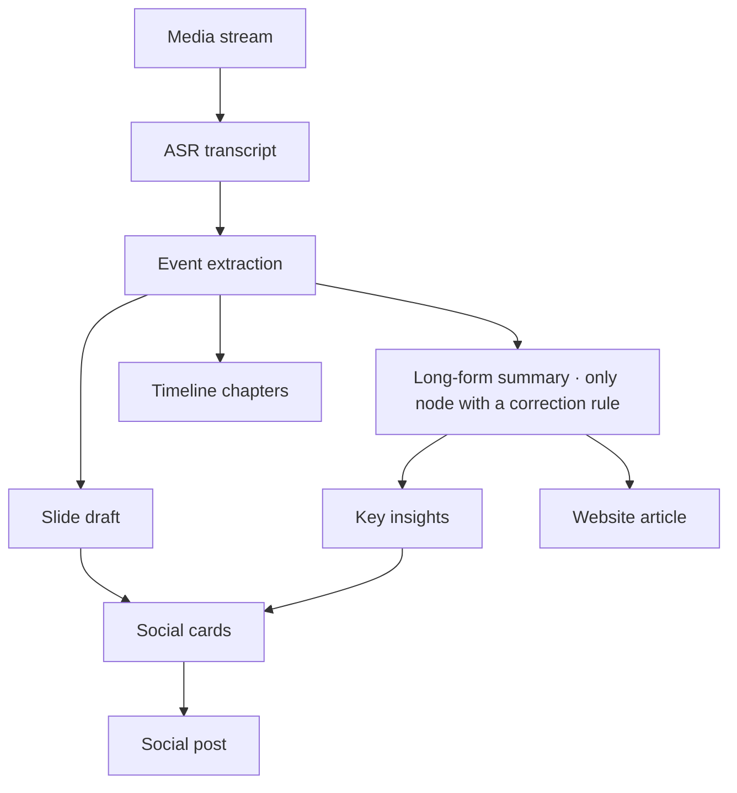
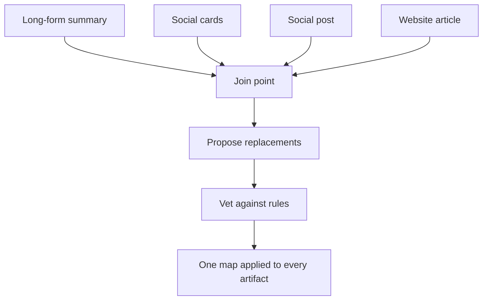

## Introduction

It started with a reader comment: "Please at least check before you publish the images — every post has a fair few typos."

My first instinct was to look at the dashboard, which was embarrassing, because that month not a single node in this **financial podcast** content pipeline had failed. Transcription succeeded. Event extraction succeeded. Summarization succeeded. Card rendering succeeded. The social post published. Every cell green, zero retries.

Then I spent most of a day and dug out six independent defects. **Not one of them was a failure.** Every one was a component correctly completing the job it was given, reporting success, and going wrong in the inch it was never given. The worse ones happened in the seam between two components, which nobody owned.

This is the record of that day. The subject is not really speech recognition, and not really CSS. It is a question I have since written onto my own review list: **is this success signal load-bearing?**

## Architectural Overview

The setup first. This pipeline turns a media stream tens of minutes long into a website article, a set of social cards, and a social post, while linking the entities mentioned to **market ticker data**.

The only part of that diagram that matters is the fan-out: **after event extraction the graph splits in two**, one branch through the long-form summary, one through slides and cards. Readers see output from both.

I had once written a prompt rule telling the model to "silently correct obvious homophone mistranscriptions". It lived in exactly one of those nodes.

## Methodology Breakdown

### 1. It was fixed, and nothing downstream used it

I started by diffing the spelling of the same entity across every stored field of one episode. The result stopped me for a second:

The long-form summary branch had the company name right 19 times out of 19. The extraction node was half right, half wrong. The slides and the cards were wrong throughout.

Which means **the correction mechanism had been working the whole time, and working well**. The node with the rule genuinely fixed the name. The cards simply do not read that node's output — they read the other branch. One episode, published in two spellings at once: correct on the website, wrong on the social cards.

That was the expensive lesson of the day, and it has nothing to do with AI:

> A correction that never reaches the published artifact is not a correction. It is an intermediate value that makes the dashboard look good.

My instinct was to copy the rule into the other three prompts. But that is four rules that will drift apart independently, and drifting apart independently is precisely what caused this. The real fix was to move the correction to the **join**: run it once, produce a single "wrong spelling → right spelling" map, and apply that same map to every artifact.

"One map applied to every artifact" is the part that matters. It does more than fix typos: it makes it **structurally impossible for one episode to contradict itself**.

Letting a model propose free-form replacements is obviously dangerous, so three deterministic rules constrain it. The replacement must be **the same length** (a same-sound swap is inherently equal-length; a length change means a rewrite), the string being replaced **must actually occur** in the text, and there is a hard cap of **twelve per episode** (past that it has stopped proofreading and started editing). The model proposes; deterministic code decides.

### 2. Same model, one with the rule, one without

At that point I was still wondering whether this was a capability problem. Would a stronger model just fix it?

The data happened to hand me a clean control group. Those four nodes run on **the same model** in the deployed configuration. Same episode, same transcript, same model:

| Node | Homophone rule? | Result |
|---|---|---|
| Long-form summary | Yes | All correct |
| Event extraction | No | Half and half |
| Slide draft | No | All wrong |
| Key insights | No | Inherited the error |

Same model. Given the rule it corrects; without it, it does not. This is not a capability problem.

The reverse evidence is more direct: the join-point correction I later wrote runs on that same model, and with a different prompt in a different position it got all three cases right on the first attempt. **The capability was always there. Nothing had ever asked for it.**

Ranked, the causes came out in the exact inverse of my instinct: **wiring > prompt scope > a config omission > model capability**. The biggest factor was not prompt text, it was that the corrected output was never consumed downstream. A perfect rule on that node would still leave the cards wrong, because they do not read it. That is a dataflow problem and no prompt edit reaches it.

## Production Optimization

Those two were design problems. The next four are success signals, and every one of them nearly fooled me.

### 3. Fixing it at the source measured worse

Cause three looked like the one most worth fixing. Speech recognition supports a vocabulary prompt that biases the decoder toward a known set of proper nouns. Get the names right in the raw transcript and every downstream node benefits: textbook root-cause work.

I wired it up, and then did the thing that is easy to skip: **an A/B against real audio**. Three shows, four clips, two or three runs each.

| Clip | No prompt | With a 14-term prompt |
|---|---|---|
| A | Entity name wrong (heard as an unrelated word) | **Correct** |
| B | Entity wrong, idiom wrong | Entity **correct**, idiom still wrong |
| C | An ordinary verb **correct** | That ordinary verb **now wrong** |
| D | 164 characters of speech | **12 characters of hallucinated caption** |

Row three was the one I had not predicted. Biasing the decoder toward a word list **drags neighbouring ordinary words toward those names too**. It fixed one entity and simultaneously replaced a perfectly correct everyday verb with a same-sounding wrong one. And nothing downstream can detect that, because the join-point correction just reads it as the source text. One error fixed, one new error created.

Row four is worse. That clip was an **arbitrarily chosen** control, not a hunted edge case, and every prompt variant destroyed it: 32 seconds of dense commentary collapsing into a single hallucinated caption line. At one point I merely swapped the order of two blocks inside the prompt and the whole clip collapsed.

So the feature shipped **wired up and off by default**, behind an environment variable, with the measurements written into the source.

"Fix it at the source" is an **instinct**, not a **conclusion**. When a fix has a wider blast radius than the thing you are fixing (a vocabulary prompt conditions the entire decode, not just that one name), its side effects will be wider than you expect too.

### 4. My guard was watching the wrong signal

Row four is a data-loss class failure, and "just leave it off" is not a mitigation. So I wrote a guard: on a suspected collapse, re-run without the prompt and keep whichever attempt produced more text. A false alarm costs one API call and can never make the output worse.

The problem was that the first version watched the wrong signal. I used **time coverage**: if the returned segments only span a fraction of the audio, call it a collapse. Entirely reasonable.

In practice, the guard never fired once. I dumped the raw response and found out why: the collapsed response **reported a segment spanning the full 32 seconds**, with twelve characters inside it. One hundred percent coverage.

Switching to **character density** (characters per second) worked. I measured normal speech in these shows at 4.5 to 5.6 characters per second, and every collapse came in under 2. Verified end to end: the collapsing clip recovers from 12 characters back to 164, while the clip the prompt helps keeps its corrected name.

This one bothered me, because I had been confident when I wrote that guard. The lesson is short:

> A guard that has never been validated against the real failure is just code that makes you feel safe.

Feed the guard the exact input that broke, every time. Without that step I would have shipped a guard that could never fire and had no way of knowing.

### 5. A 200 OK containing six rows

The cards had another symptom: close to a third of the ticker fields displayed a bare code instead of a company name.

It came down to one conditional. The registry loader was supposed to try the platform API and fall back to a local seed file on failure, and "failure" had been written as "the response is not null".

That API was perfectly healthy. It returned 200 and a valid array. Its semantics, though, were "rows that carry curated aliases", and there were six of them. The code treated those six as the entire registry, so the local seed file, with well over two thousand entries, **could never be reached**.

`the response is not null` and `the response contains what I need` are two different propositions, and I had written them as one line. The fix was to **merge** rather than choose: local seed as the floor, platform rows as the overlay. While I was there I also repointed the display name to ask the translation table directly.

### 6. A rule that was correct and never got a turn

The last one is layout. Cover-image subtitles were frequently cut off, and cut badly: not trimmed at the end of a line but **sliced horizontally through the middle of the glyphs**, second line halved, third line gone entirely.

I went to the CSS first, where a clamp rule plainly said "at most three lines". The rule was correct.

What actually happened: the outer element is a column flex container, and the subtitle is a flex item with overflow hidden. Once the content exceeded the available height, **flex squeezed that box first** (`flex-shrink` defaults to 1), the box was compressed to less than one line tall, and overflow hidden then cut straight through the glyph row. The three-line clamp never got a turn — by the time it applied, the box was already shorter than one line.

Two fixes: turn off the shrink (so any clipping lands on a line boundary with an ellipsis), and add content-aware type-scaling tiers. That mechanism already existed for another card type in the same file; the cover had simply never been connected to it. Scanning roughly a hundred recent episodes, **about two thirds of covers were overflowing**, which matches the reader's "every post".

I like this case the most, because it is the least AI-shaped of the six and it is the same shape as all of them: **a perfectly correct rule sitting in a position where it never gets control.**

## Conclusion

Laid side by side, the six signals are one story:

| What the signal reported | What it did not say |
|---|---|
| Summary node corrected successfully | The corrected version is not the one that ships |
| API returned 200 and a valid array | The array does not mean "all of them" |
| Speech response covers the full audio | There are twelve characters inside it |
| A clamp rule exists and is correct | The box was squeezed before it applied |
| Vocabulary prompt fixed the target word | It broke the ordinary word next to it |
| Pipeline all green, zero retries | Nothing was checking whether the content was right |

The last row is the expensive one. **Every check in this pipeline asked "did this step complete", and none asked "is the output correct".** In a system where every node succeeds but every node's output can carry content defects, the distance between "it ran" and "it is right" is exactly what the user sees.

Three things went onto my review list:

1. **Put corrections at the join, not on a branch.** As soon as one artifact grows out of a different path, a rule patched onto one branch will miss it. One map applied to everything is what makes self-contradiction structurally impossible.
2. **Ask of every success signal whether it is load-bearing.** "Not null", "covers the full duration", "the rule exists": all three were true, and all three were irrelevant to what I needed.
3. **Fixing at the source is an instinct, not a conclusion.** Measure it. And watch the blast radius: a fix with a wider scope than the defect will have wider side effects than you planned for.

There is one more that is less comfortable to admit. All six defects predated the reader's comment and would have persisted indefinitely, because **not one of them turns a dashboard red**. What surfaced them was not monitoring. It was one user who bothered to leave a comment — which is itself worth designing for.

## Reference

- [MDN — CSS Flexible Box Layout: Controlling ratios of flex items along the main axis](https://developer.mozilla.org/en-US/docs/Web/CSS/CSS_flexible_box_layout/Controlling_ratios_of_flex_items_along_the_main_axis) — why `flex-shrink` defaults to 1, and how overflow behaves on a squeezed flex item.
- [OpenAI — Speech to text: prompting](https://platform.openai.com/docs/guides/speech-to-text#prompting) — the semantics of Whisper's prompt parameter (it models *preceding* speech, so the tail is what survives) and its length ceiling.
- [Google SRE Book — Monitoring Distributed Systems](https://sre.google/sre-book/monitoring-distributed-systems/) — why liveness-style metrics cannot answer whether what the user received was correct.
- [Martin Fowler — Data Mesh Principles](https://martinfowler.com/articles/data-mesh-principles.html) — ownership boundaries for data artifacts; the join-point correction here is essentially pulling ownership back from the branches to a single accountable point.
