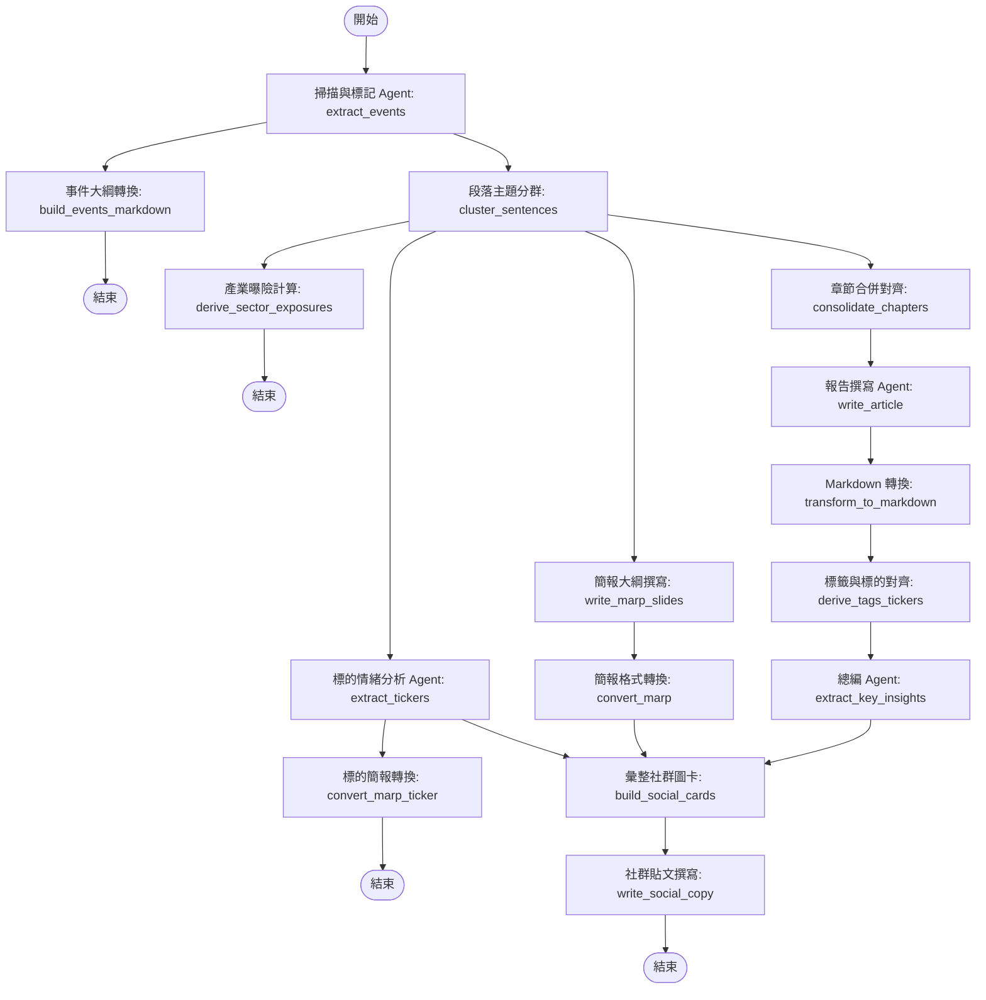

最近我花了一段時間，將專案中負責處理非結構化**財經 Podcast** 語音串流與逐字稿的 AI 數據 Pipeline，從最初的單一 Ingestion 腳本逐步演進為基於多 Agent 協作的生產級版本。

在我的實踐中，我發現最大的挑戰並非語音轉文字本身（透過呼叫雲端語音轉寫服務，將音訊轉為原始逐字稿已經非常便宜且容易解決），而是**如何從極度冗餘、充滿雜訊的逐字稿中，產出穩定、高品質且符合結構化 Schema 的財經摘要與市場標的分析**。

這篇文章我想分享自己在這段演進過程中的架構思考，記錄我是如何一步步克服「請 LLM 幫我摘要」的瓶頸，並透過 LangGraph 設計出一個由多個 Agent 協同作戰的處理圖譜。

---

## 陽春版的瓶頸：為什麼「請幫我摘要這段逐字稿」注定失敗？

在剛開發第一代 Ingestion 腳本時，我的作法非常直覺：取得原始逐字稿後，直接包進一個簡單的 Prompt 中送給大語言模型，指令大概就是「請幫我整理這段逐字稿的摘要、重點與提及的市場標的數據（Market Ticker Data）」。

然而，實際面對真實的財經 Podcast 節目時，這種做法產出的摘要簡直不堪入目，原因在於真實的對談音訊中充斥著以下四大雜訊：

1. **廣告與贊助商訊息 (Sponsor Announcements)**：主持人常在開頭或中間穿插 VPN、線上課程或券商的廣告。大模型在處理時，很容易將這些廣告內容誤認為本集討論的「財務洞察」，甚至直接寫進摘要重點。
2. **生活雜談與暖場閒聊 (Chitchat & Intro)**：主持人切入正題前，通常會有數分鐘至十幾分鐘的近況分享。這些內容雖然增加節目娛樂性，但對尋求財務洞察的讀者而言完全是多餘的雜訊。
3. **訪談的口語冗餘與跳躍思考**：尤其是雙人主持或專訪節目，充滿了口語贅字與跳躍性對談。整篇逐字稿往往長達兩三萬字，但真正有價值的核心觀點可能只佔 10%。
4. **長文本注意力渙散與多人對話交錯 (Lost in the Middle)**：談話內容常在多個標的之間快速切換。如果直接硬吞整篇逐字稿，模型很容易在長文本中注意力渙散，導致摘要時而詳細、時而漏掉關鍵個股。

如果只用一個 Prompt 硬吞整篇逐字稿，大模型不是因為 Context 過長而偏離主題，就是因為格式錯亂而崩潰。為了產出真正具有專業水準、只保留財經核心洞察的精簡資料，我意識到必須將任務解耦，改由多個專門的 Agent 來分工協作。

---

## 基於 LangGraph 的多 Agent 協作設計

為了解決單一模型調用的局限性，我選擇使用 LangGraph 來重新建構整個工作流。

LangGraph 的「狀態圖（StateGraph）」概念非常適合這種複雜的 DAG（有向無環圖）流程。我們能定義一個共享的狀態對象（State），讓每個節點（Node）只負責處理狀態中的一部分資料，並在完成後更新狀態傳遞給下一個節點。這樣做的好處是，我們能將「過濾、章節合併、報告撰寫、個股分析、總編校驗」等工作完全解耦。

### 系統拓撲設計

這是我在專案中實際編排的 StateGraph 拓撲流程。整個 Pipeline 在執行時，會從入口節點進入，進行平行分流與最終的匯合（Fan-out / Fan-in）：

---

## 核心 Agent 與節點的分工機制

在這套 LangGraph 工作流中，每個節點都有其明確的職責與邏輯：

### 1. 掃描與標記 Agent (`extract_events`)
* **職責**：雜訊清理與核心事件提取。
* **工作邏輯**：它是整條 Pipeline 的第一線。它通讀原始逐字稿，目標不是寫摘要，而是進行「掃描與標記」。它會將逐字稿中的段落歸類為特定的封閉詞彙標籤（包含 sponsor, intro, outro, chitchat, analysis, guest, qa, unknown），並標記該段落是否具備「市場實質內容（is_substantive）」。
* **句子位置分片機制 (Sentence-Position Chunking)**：超長的 Podcast 逐字稿如果一次全部送給 LLM 進行提取，模型回傳的結構化資料很容易因為長度限制而被截斷。我設計了「句子位置分片」機制：當句子數超過臨界值時，系統會自動將逐字稿切成每 800 句一組的分片分別進行呼叫，並將模型回傳的局部索引偏移還原回全域位置，最後再合併輸出。這徹底解決了長文本導致 LLM 輸出中斷的問題。

### 2. 政策路由器與章節合併器 (`cluster_sentences` & `consolidate_chapters`)
* **職責**：結構化時間線與章節對齊。
* **工作邏輯**：這是結合了確定性程式邏輯的節點。
  * **政策路由器**：根據設定檔政策，直接丟棄非實質內容的段落（例如直接過濾 sponsor, intro, outro, chitchat 等廣告與閒聊），只保留具備市場分析價值的片段。這解決了以往使用關鍵字比對容易讓廣告漏網的問題。
  * **章節合併器**：由於提取 Agent 為了精準過濾廣告，會把事件切得非常細碎。如果直接根據這些細碎事件寫摘要，報告會變得支離破碎。章節合併器會根據音訊時長動態計算目標章節數量（每 5 分鐘一個章節，最少 4 個，最多 12 個），把相鄰的細碎事件合併為適當長度的大章節，供後續撰寫使用。

### 3. 報告撰寫 Agent (`write_article`)
* **職責**：內容組織與文案撰寫。
* **工作邏輯**：它不閱讀冗長且多雜訊的原始逐字稿，而是拿著合併後的乾淨章節資訊進行擴寫。它負責將這些觀點整理成邏輯通順、專業嚴謹的財經報告初稿。
* **分片撰寫與合併**：與提取階段類似，若輸入章節數過多，寫作節點也會進行分片分別調用，最後再合併各段落的標題、前言、正文與結論，避免單次輸出 token 溢出。

### 4. 總編 Agent (`extract_key_insights`)
* **職責**：事實核對與品質提煉。
* **工作邏輯**：它是這條流水線的品質防線。它讀取撰寫 Agent 產出的 Markdown 報告，提煉出 3 至 8 條精簡的關鍵洞察（Takeaways），並進行嚴格的格式清洗，確保每條洞察字數在 80 字以內，符合前端卡片版面的要求。
* **確定性備用機制 (Fallback)**：當 LLM 因為生成異常而回傳少於 3 條洞察時，系統會啟動確定性備用機制，自動從 Markdown 摘要中依據句號切分，篩選出符合長度限制的句子進行遞補，確保資料庫欄位永遠符合資料契約。

### 5. 標的與情緒分析 Agent (`extract_tickers`)
* **職責**：個股標的情緒與風險深度剖析。
* **工作邏輯**：專注於提取節目中提及的個股標的情緒（看多/看空/中立）、目標價與潛在風險，產出結構化的評級分析，並發散連結至領域詞彙庫與產業曝險分析。

---

## 上集總結

在第一個階段中，透過將單一 Prompt 的粗暴呼叫拆解為 LangGraph 上的分散式節點，我們不僅解決了長文本截斷與廣告雜訊干擾的痛點，更讓每一個步驟都有專屬的 Agent 進行守護。

然而，將這套系統搬上生產環境時，新的挑戰才剛開始：
* 多 Agent 意味著多次外部模型呼叫，一旦中間步驟失敗，該如何避免重頭來過？
* 當我們使用推理模型 (Reasoning Models) 時，為什麼結構化輸出會莫名截斷？
* 如何防範 LLM 生成幻覺寫入資料庫？

在下集中，我將深入分享我們在生產環境實踐的 **Step-by-step Checkpoints 重播機制、推理解算溢出應對策略與寫入前強校驗防寫閘 (Pre-Persistence Gate)**。

---

## Reference

- **[LangGraph Documentation](https://langchain-ai.github.io/langgraph/)**：理解如何使用 StateGraph、Nodes 和 Edges 建構具備循環與條件分支的多 Agent 系統。
- **[Python asyncio Documentation](https://docs.python.org/3/library/asyncio.html)**：深入學習 asyncio.Semaphore 與 Event Loop，以實現高效的異步任務編排。
- **[LangChain OpenAI Integration Guide](https://python.langchain.com/docs/integrations/chat/openai/)**：了解如何配置 ChatOpenAI 以及自訂 API 請求參數。
