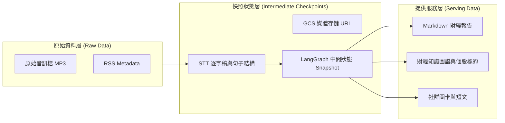
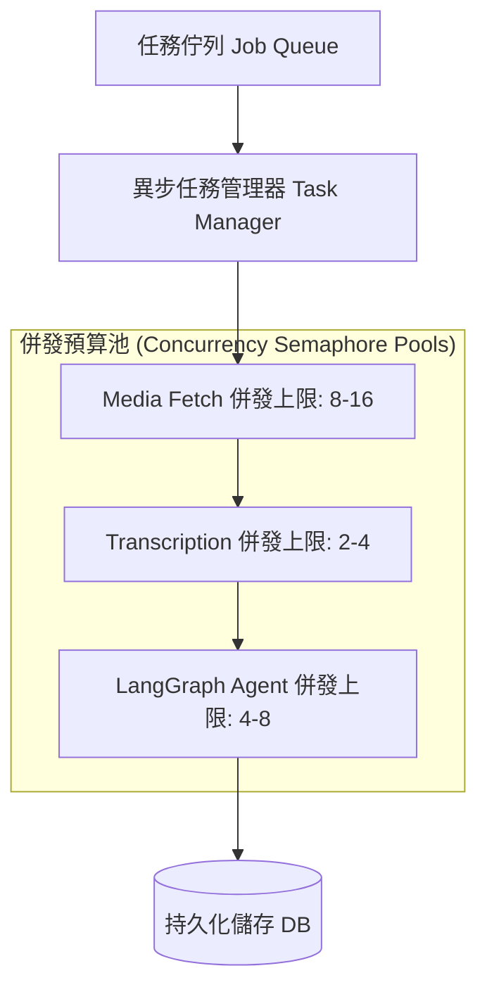

在上集中，我分享了如何透過 LangGraph 將複雜的非結構化**財經 Podcast 語音串流**處理流程解耦，建構出由多個 Agent 協作的拓撲圖譜。

然而，當這套多 Agent 系統正式進入生產環境運作時，我們很快迎來了工程上的真正考驗：
* 長達數十分鐘的語音與多 Agent 協作意味著昂貴的 API 調用與時間成本，一旦後續節點失敗，難道要從頭轉錄音檔嗎？
* 在選用先進的推理模型 (Reasoning Models) 進行內容提煉時，為什麼結構化 JSON 輸出經常在後半段莫名截斷？
* 當 LLM 偶爾產生幻覺或輸出一半失敗時，如何防範髒資料（Placeholder）覆蓋資料庫中的歷史正常資料？

這篇文章我將深入分享我們在生產環境累積的四大實戰經驗：**Step-by-step Checkpoints 可恢復機制、推理模型 Token 預算防禦、寫入前強校驗防寫閘 (Pre-Persistence Gate)，以及併發預算控制**。

---

## 1. Step-by-step Checkpoints 與可重播資料工廠

在早期的陽春架構中，Pipeline 通常只在所有步驟都執行完畢後才保存最終成果。但處理一個完整的 Podcast 節目包含音檔下載、STT 語音轉寫、LangGraph 多 Agent 摘要與社群素材渲染，整體耗時可能長達數分鐘。

如果系統在最後一關（例如渲染社群圖卡）因為格式問題報錯，而我們必須重跑整條 Pipeline，這不僅意味著數分鐘的等待延遲，更代表我們重跑了昂貴的語音轉寫 API。

為了打造真正具備容錯能力的可恢復系統，我將資料架構明確劃分為三個層級：

### 實作 `rerun_from` 重播恢復機制

在每一階段完成後，中間狀態（下載好的音檔、轉寫好的逐字稿句結構、上傳雲端後的 URL）都會被實時持久化。

我設計了 `rerun_from` 參數控制。當維運人員或背景任務發現後續步驟出錯時，可以指定重跑起始點。例如指定重跑摘要階段（`rerun_from="summarize"`），系統重新執行時會直接載入已快照的逐字稿，跳過下載音檔與 STT 轉寫，直接將中間狀態喂入 LangGraph 狀態圖。

這不僅節省了 80% 以上的重試時間，也徹底杜絕了重複調用轉寫 API 所產生的費用。

---

## 2. 模型選型與推理解算溢出踩坑 (Reasoning Tokens Defeats JSON)

在多 Agent 系統中，模型選型直接決定了摘要品質與系統穩定度。我利用 OpenRouter 對不同模型進行了多輪對比測試：

| 評估維度 | 主力推理模型 (如 DeepSeek 系列) | 對照組快模型 (如 Gemini Flash 系列) |
| :--- | :--- | :--- |
| **摘要篇幅與結構** | 緊湊且具備專業編輯感。能精準過濾非財經相關的閒聊與贊助廣告。 | 較為冗長與直白，傾向完整保留所有問答對疊與無意義結尾。 |
| **標籤與標的品質** | 標籤數量適中，高度符合專案「封閉標籤詞彙庫」約束。標的提取精準。 | 標籤嚴重通膨，且會發明無效標籤，導致校驗時被剔除。 |
| **個股情緒提取** | 能精確對齊段落，產出結構完整的多空論點與風險分析。 | 覆蓋面廣但資訊密度較低。 |

### 深度踩坑：消失的 `max_tokens` 預算

雖然推理模型在內容緊湊度與標的精準度上明顯勝出，但在實踐中，我踩到了一個嚴重的生產坑：**超長節目在進行事件提取或個股分析時，模型回傳的 JSON 經常在後半段被莫名截斷（出現 `Unterminated string` 等解析錯誤）**。

經過深入排查，我發現推理模型（Reasoning Models）會將大量的 Token 用於「隱藏思考過程（Reasoning tokens）」，這嚴重擠壓了真正輸出的 `max_tokens` 預算（例如 4096 tokens Limit）。當思考過程過長，留給 JSON 輸出的預算不足，輸出就會被強制截斷。

### 解決方案：顯式停用推理思考過程

為了解決這個問題，我在透過 API 呼叫推理模型時，**顯式關閉了推理思考過程**（傳入 `extra_body={"reasoning": {"enabled": False}}`）。

如此一來，模型不會在思考過程中消耗 Token 預算，而是將完整的 Token 額度全部留給結構化的 JSON 輸出，徹底解決了超長 Podcast 摘要輸出截斷的痛點。

---

## 3. 寫入前強校驗防寫閘 (Pre-Persistence Gate)

在早期的版本中，如果外部 API 失敗，系統有時會回傳預留字元（placeholder）內容；或者當 LLM 產生幻覺時，提取出的個股標的清單與 Markdown 正文內容不一致（例如標的清單有 AAPL，但摘要正文中完全沒提及蘋果公司）。如果直接寫入資料庫，就會覆蓋掉之前原本正確的歷史資料。

為此，我在寫入層前增加了一個強校驗閘（`assert_summary_persistable`），在記憶體中進行雙重驗證：

1. **拒絕預留字元 (No Placeholders)**：嚴格檢查產出的內容是否包含預留字元標記，若有則直接阻斷寫入。
2. **標的內文一致性校驗 (Ticker Mismatch Gate)**：驗證標的清單中的所有個股，是否都以特定格式（例如 `#ticker:SYMBOL`）明確出現在 Markdown 摘要正文中。

如果發現有任何個股標的未在正文中出現，判定為標的不匹配（Ticker Mismatch），系統會直接拋出異常並拒絕持久化寫庫，確保生產環境資料庫的絕佳完整性。

---

## 4. 併發預算 (Concurrency Budget) 與 Rate Limit 控制

多 Agent 協作意味著處理單一任務會在短時間內發起多次 API 呼叫。當背景排程同時處理多個 Podcast 節目時，極易觸發模型供應商的 429 速率限制（Rate Limit）。

我利用 Python `asyncio.Semaphore` 機制，為整條 Pipeline 的各個 Stage 設定了獨立的併發信號標：

將不同 Stage 的併發預算解耦後，我們確保了便宜的媒體抓取不會卡住昂貴的模型呼叫，同時模型的平行發起數量也被精準鎖定在安全水位以下，維護了系統的高效穩定。

---

## 圖表與配圖建議 (Visual Plan)

### 圖 1：線性 Pipeline 與可恢復資料工廠對比圖
* **用途**：展示單線 LLM 流程（容易出錯、無法部分恢復）與帶有 Checkpoint 的多 Agent 流程之健壯性對比。
* **位置**：置於第一節 Checkpoints 開頭。
* **圖表說明**：`可恢復的資料工廠：透過 raw, checkpoint, serving 三層設計實現失敗恢復。`
* **靈感來源**：參考 **Netflix Tech Blog** 介紹媒體處理管道的架構圖風格，使用乾淨的藍灰色調與清晰的快照節點。

### 圖 2：併發預算控制面板
* **用途**：將不同 Stage 依據頻寬與 API 限額進行併發節流的概念視覺化。
* **位置**：置於第四節併發預算控制。
* **圖表說明**：`各階段併發預算分配與水位控制，確保系統不會觸發 429 Rate Limit。`
* **靈感來源**：參考 **Stripe Technical Blog** 的 Rate Limiter 與併發防禦儀表板風格。

---

## 總結

建構一個生產級的財經 Podcast Ingestion 管道，核心不在於單一 LLM 模型有多強，而是在於**如何通過工程化的設計，將不可預測的大模型調用包裝在一個可預測、可控制、具備容錯快照的軟體系統中**。

回顧整個系列的關鍵工程經驗：
1. **解耦為多 Agent 拓撲**：利用 LangGraph 解決廣告雜訊與長文本截斷。
2. **建立 Step-by-step Checkpoints**：讓任務具備狀態快照，節省重試時間與 API 成本。
3. **關閉 Reasoning Tokens**：解除推理模型在結構化 JSON 輸出時的 Token 截斷危機。
4. **設立寫入強校驗防寫閘**：拒絕 Placeholder 與標的不匹配資料寫入生產庫。

這套架構讓我們的數據管道在面對各種口語雜訊與音訊挑戰時，依然能夠穩定地輸出高品質的財經知識圖譜。

---

## Reference

- **[LangGraph Documentation](https://langchain-ai.github.io/langgraph/)**：理解如何使用 StateGraph、Nodes 和 Edges 建構具備循環與條件分支的多 Agent 系統。
- **[LangChain OpenAI Integration Guide](https://python.langchain.com/docs/integrations/chat/openai/)**：了解如何配置 ChatOpenAI 以及自訂 API 請求參數（如關閉 reasoning 或啟用 json_mode）。
- **[OpenRouter API Documentation](https://openrouter.ai/docs)**：理解 OpenRouter 提供的模型路由與 Rate Limits 處理。
- **[Python asyncio Documentation](https://docs.python.org/3/library/asyncio.html)**：深入學習 asyncio.Semaphore 與 Event Loop，以實現高效的異步任務編排。
