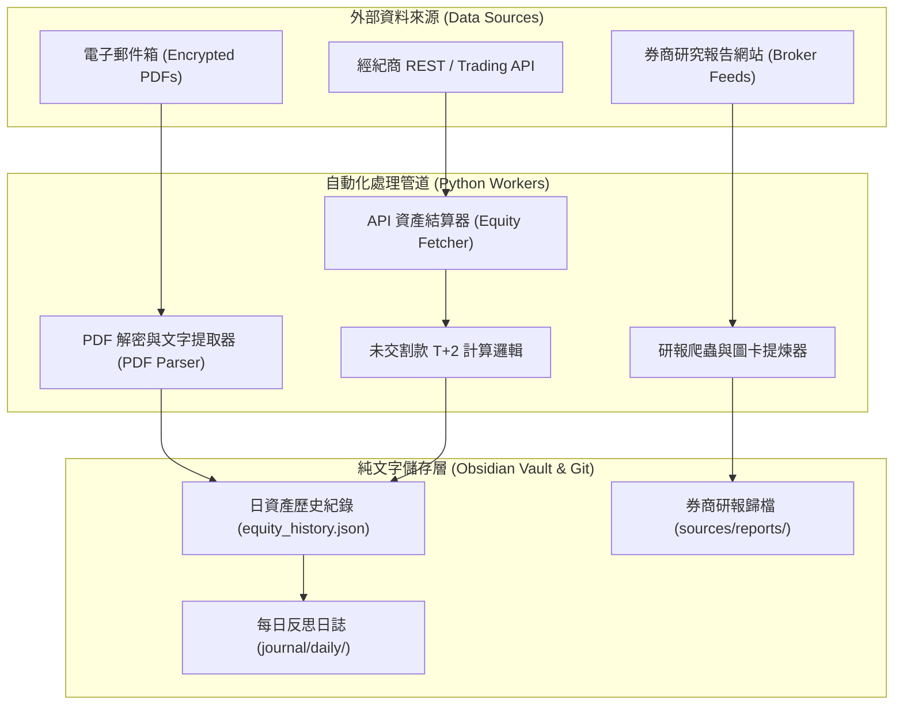
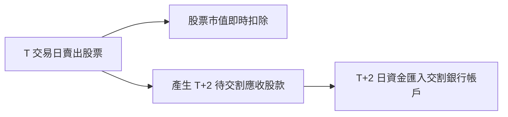

## 前言 (Introduction)

在建立個人常駐助理系統（Resident Assistant System）的過程中，最核心的價值並非大語言模型「有多會對話」，而是「能否提供穩定、精準、絕不偷懶的個人數據與市場資訊」。

在投資與資產管理上，我們每天常面臨兩個非常繁瑣的痛點：
1. **多帳戶權益數散落各處**：海外券商、本地期貨與現股帳戶各自有獨立的登入介面或電子對帳單。每天盤後手動登入各平台記帳極度耗時且容易遺漏。
2. **市場研報資訊過載**：各大券商每日發布大量研究報告與產業深度分析，若無自動化抓取與結構化歸檔，資料很容易淹沒在郵件海中。

為了讓個人助理具備真實可靠的資產感知與資訊研讀能力，我設計了一套基於 Python 與 Cron 排程的自動化管道：從每日解密電子對帳單 PDF、呼叫經紀商 API 結算權益數，到自動抓取券商研報並提煉知識圖譜。

---

## 架構設計 (Architectural Overview)

這套自動化追蹤系統的數據流可以分為「資產權益數結算」與「券商研報爬蟲」兩大獨立軌道：

系統運作的核心原則是：**資料擷取與計算走確定性 Python 腳本，LLM 僅負責後置的自然語言提煉與知識連結**。

---

## 方法論拆解 (Methodology Breakdown)

### 1. 破解黑盒：加密電子對帳單 PDF 的自動化解析

本地期貨與券商通常不會提供即時開放的 REST API，而是於每日收盤後將加密的電子對帳單 PDF 寄至使用者信箱。

為了在不依賴 OCR 辨識（OCR 速度慢且容易出現數字誤判）的前提下精確提取數據，我採用了純 Python 處理管線：
* **郵件收件箱監控**：透過自動化腳本於傍晚定時掃描信箱中特定主題的對帳單郵件，下載 PDF 附件至本地隔離收件匣。
* **密碼安全解密**：利用 Python PDF 處理庫注入環境變數中的加密密碼進行無損解密。
* **結構化文字與表格提取**：利用 PDF 文字提取技術定位對帳單中的關鍵欄位（如「權益數」、「期貨保證金餘額」），以確定性正規表示式 (Regex) 提取精確金額。

這套純程式碼解析流程能達到 100% 的數字精確度，徹底消除了人工對帳與 OCR 影像誤判的風險。

### 2. 時差與未交割款計算 (T+2 Settlement Handling)

在計算股票現股帳戶的當日資產總額（NAV）時，我遇到了一個極具代表性的「假失真」坑：**T+2 股票交割款時差**。

當天賣出股票時，交易所會立即將股票從集中保管帳戶中扣除，但賣出所得的現金在 T+2 結算日之前，並不會反映在券商交割銀行的實際可用現金餘額中。如果直接計算「銀行現金 + 股票市值」，賣出股票當天的帳戶總資產會發生瞬間假摔；反之，買進股票當天則會發生瞬間假增。

為了解決這個問題，資產計算器引入了**未交割款修正算式**：
* 總資產金額等於「已結算銀行現金餘額」加上「未交割款應收/應付總額（T+1 / T+2）」再加上「當前持股總市值」。
* 透過向經紀商查詢當前未交割款明細，成功維持了資產總額在交易日與交割日之間的平滑與準確。

### 3. 多經紀商 API 整合與自動繪圖

對於提供開放 API 的海外券商與衍生品帳戶，系統利用 REST API 與輕量交易 SDK 定時抓取當前帳戶清算價值（Liquidation Value）與保證金權益數。

每日晚間收盤後（如 23:00），排程器會啟動資產彙整工作：
* 將各帳戶當日數字追加寫入本地 JSON 歷史檔案。
* 自動調用繪圖模組，產生多帳號資產走勢疊加圖。
* 將當日淨值與變動百分比格式化為 Markdown 表格，自動插入當天的每日反思日誌（Daily Journal）中。

### 4. 券商研報自動爬蟲與知識圖譜構建

除了資產追蹤，系統每日亦會自動執行券商研報爬蟲：
* 自動掃描並下載合作券商每日發布的個股與產業報告 PDF。
* 提取報告中的目標價、評等變更與核心論點。
* 將原始 PDF 與 Markdown 摘要分類歸檔至本地知識庫，並建立按個股標的與產業分類的索引標籤，使個人助理能在聊天視窗中隨時檢索原檔。

---

## 生產環境踩坑與優化 (Production Optimization)

### 1. 誤把「最新已知數值」充當「當天數據」

在早期版本中，當某個帳戶的郵件尚未寄達或 API 連線逾時，腳本若自動帶入前一天的數據並標記為今天，會造成持續數天的資產數據停滯卻不自知。解法是：**無資料時明確標記資料缺失（Data Missing），並在日誌中顯示預警**，直到資料真正補齊。

### 2. 郵件到達時間不固定

不同經紀商的結算郵件寄發時間並不固定（有些在傍晚 18:00，有些在晚上 21:30）。如果 Cron 排程太早執行，容易抓到空檔。為此，排程器設計了 **4 天滾動補發視窗 (4-Day Window Backfill)**，每次執行時都會自動檢查並補齊過去 4 天內可能漏抓的日結對帳單。

### 3. PDF 格式變更與防護

券商偶爾會更換對帳單 PDF 的版型或表格排版。為防範版型變更導致提取金額錯誤，解析器加入了**合理性邊界檢查**：如果提取出的權益數變動超過單日預設百分比上限，系統會阻斷寫庫並發出警報，等待人工確認版型。

---

## 圖表與配圖建議 (Visual Plan)

### 1. 兩軌自動化處理管道架構圖
* **用途**：展示資產權益數與研報爬蟲兩大軌道的輸入、處理與 Vault 輸出。
* **位置**：置於架構設計段落。
* **圖表說明**：`雙軌數據管道：左軌處理加密 PDF 與 API 權益數，右軌處理研報爬蟲與知識歸檔。`

### 2. 未交割款 (T+2 Settlement) 修正平滑圖
* **用途**：對比未修正前（資產假摔/假增）與修正後平滑資產曲線的差異。
* **位置**：置於未交割款方法論段落。

---

## 總結 (Conclusion)

一個真正值得信賴的個人常駐助理，其底層必然建立在**高穩定度、低維護成本的數據工程**之上。

透過 Python 腳本處理加密對帳單 PDF、利用 API 結算多帳戶權益數、修正 T+2 交割時差，並以單一 Git Sweeper 進行純文字 Vault 歸檔，我們成功在完全不洩漏隱私與金鑰的前提下，打造了一座自動化個人資產與研報中心。

---

## Reference

- **[Python pikepdf Documentation](https://pikepdf.readthedocs.io/)**：基於 QPDF 的高效能加密 PDF 解密與處理庫。
- **[pdfplumber Documentation](https://github.com/jsvine/pdfplumber)**：精準提取 PDF 內文文字、表格與座標佈局的 Python 工具。
- **[Python matplotlib Documentation](https://matplotlib.org/)**：自動化圖表繪製與趨勢圖生成。
