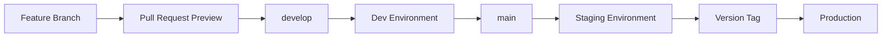
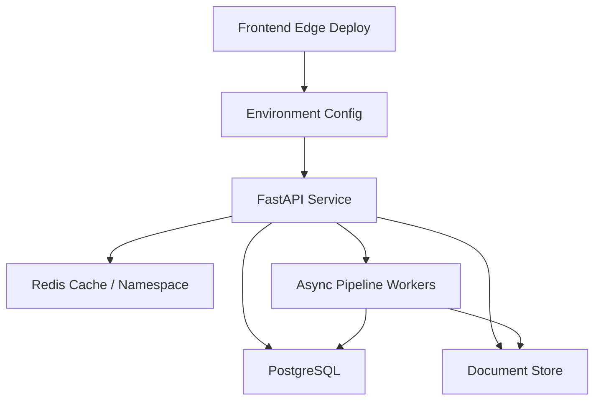

## 前言 (Introduction)

很多小團隊或個人開發者一開始會覺得環境分層太重：本機能跑、main branch 能部署，似乎就足夠了。直到第一次發生這些事情：

1. 一個資料庫 migration 在本機成功，但 production schema 欄位不一樣。
2. 前端 build 正常，部署後才發現 API base URL 指到錯誤環境。
3. OAuth 授權、快取、CORS 跨域設定與 secret rotation 在本機都無法真實測試。
4. 修 bug 的 hotfix 和下一版尚未驗證的功能混在同一條 deploy path 裡。

Dev / Staging / Production 的價值，不是讓流程看起來更企業化，而是把「不確定性」隔離在正確的位置。Dev 用來快速整合，staging 用來模擬 production，production 只接受已驗證的 release。

對一個以 React 19 + TypeScript + Vite 為前端、FastAPI 為後端、Docker + Caddy + Redis 為基礎設施、PostgreSQL / Firestore 混合資料層的系統來說，環境分層是提升發布速度與維運質量的核心底座。

---

## 架構設計 (Architectural Overview)

一個簡潔但實用的環境推進策略（Promotion Path）可以長這樣：

這條線的重點不是「環境比較多」，而是每一站回答不同的問題：

| 階段 | 主要問題 | 應該驗證的事 |
|---|---|---|
| **Preview** | 這個 PR 自己能不能建置？ | Typecheck、Lint、Build、UI 畫面檢視 |
| **Dev** | 最新整合結果有沒有破壞既有功能？ | API contract、Migration 運作、基本 smoke test |
| **Staging** | 下一個 release 是否足夠接近 production？ | Secrets、Cache、OAuth、Reverse proxy、資料層連線 |
| **Production** | 已驗證版本是否健康？ | Health check、Error rate、Rollback target |

完整系統的環境架構可以想成多條部署軌道互相對齊：

環境切分的目的，不是複製三套完全一樣的昂貴基礎設施，而是確保 release 在進 production 前，已經通過足夠接近真實世界的檢查。

---

## 方法論拆解 (Methodology Breakdown)

### 1. 把分支策略與環境策略緊密綁定

如果 branch 和 environment 沒有對應關係，部署就容易變成口頭約定與手動操作。比較穩定的方式，是讓 promotion path 非常清晰：

這樣團隊中每個人都能明確理解：新功能先進 preview，整合進 dev，release candidate 進 staging，最後才用 tag 或正式版本標籤進 production。

### 2. 每個環境都要有獨立的 Secret 邊界

環境分層最怕「看起來分開，實際上共用」。最危險的共用通常不是程式碼，而是 Secret、資料庫與 Cache。

最低限度，每個環境應該明確分隔：

- API base URL
- OAuth callback URL / allowed origins
- JWT 或 Session 簽發密鑰
- Redis namespace 或獨立 Instance
- 資料庫連線字串 (Database Connection String)
- 物件儲存與 Document store 的資料夾命名空間
- 第三方服務的 API 測試 Credentials

這不是為了格式潔癖，而是為了避免測試過程中的測試帳號、髒資料或快取 Key 意外污染生產環境。

### 3. Staging 的任務是「像 Production」，而不是「像 Dev」

Dev 環境可以吵雜、可以快速迭代、甚至可以允許短暫壞掉。但 Staging 完全不同。Staging 的唯一任務是回答：「如果我現在把這個 release 推上去，它在 Production-like 條件下會不會壞掉？」

因此 Staging 應該盡量複製 Production 的運作條件：

- 相同的 Reverse proxy 配置與 HTTPS 轉發模式。
- 相同的 Docker image 建置與容器打包路徑。
- 相同的 Secret 載入與環境變數注入機制。
- 類似的快取 Cache-Control 標頭。
- 類似的 OAuth 與 CORS 跨域設定。
- 相同的資料庫 Migration 執行流程。

流量規模可以不同，但系統拓撲和面臨的潛在風險類型必須一致。

### 4. Health Check 要回答「能不能服務」，而不是只回答「Process 還活著」

很多系統的 `/health` 端點只回傳單純的 `ok` 狀態，這對自動化部署驗證的幫助非常有限。一個實用的 Health check 至少要檢查並回答：

1. API Process 是否能正常回應 HTTP 請求？
2. Redis 快取快取層是否連線正常？
3. 資料庫是否能成功執行基本查詢？
4. 當前跑的是哪一個 Release Identity (Git Commit / Version Tag)？
5. 當前運行的 Runtime Stage 為何？

注意，Health check 不應該洩漏敏感 Secret 或完整連線細節，其目標是讓 CI/CD 與維運人員能快速判定「當前版本是否具備服務能力」。

### 5. Cache 與 CDN 也是 Release 的一部分

如果前端部署在 Edge Network，後端又有 Redis cache，那發布流程就不能只看 Container 有沒有更新。它還要回答：

- 新版 API response schema 是否會被舊的快取內容污染？
- Edge cache 的 TTL 是否會導致使用者看到前後端版本不一致？
- 什麼情況下該等待短 TTL 自然過期，什麼情況下需要主動執行 Host-scoped purge？
- Redis key 是否包含 schema 版本或環境命名空間標記？

這些細節平常看似繁瑣，但一旦前後端 API 契約（Contract）變更，它們會瞬間變成系統是否崩潰的核心關鍵。

---

## 生產環境踩坑與優化 (Production Optimization)

在實踐這套環境分層時，我積累了幾點關鍵的生產環境經驗：

### 1. 環境變數命名一致，但值的意義不一致

在早期經驗中，Dev 和 Staging 都使用 `DATABASE_URL` 變數名稱，但 Staging 資料庫的 Schema 卻比 Production 舊。解法不是改變變數命名，而是建立 **環境 Bootstrap Checklist**：Migration 版本、測試 Seed 資料、CORS Origins、OAuth Callback、Redis 命名空間以及 Worker Concurrency 額度都必須包含在檢查範圍內。

### 2. Staging 變成另一個 Dev

如果 Staging 使用了不同的 Reverse proxy、不同的 Cache 標頭，或不同的登入設定，那它就無法回答「Production 會不會壞」。Staging 可以不需要龐大的流量，但部署拓撲、API Gateway、Cache 策略與 Secret 載入機制應盡可能與 Production 保持一致。

### 3. Production Deploy 缺乏 Release Identity

使用 Version Tag 或 Release ID 的目的，是讓每一次發布都有明確可追蹤的邊界。當生產環境錯誤率上升時，系統必須能快速回答：
1. 目前 Production 跑的是哪一個版本？
2. 這個版本對應到 Git Commit 的哪一次變更？
3. 它與上一個健康版本差別在哪裡？
4. 如果要進行回滾（Rollback），目標 Tag 是哪一個？

### 4. 非 Production 環境的 QA 與登入流程被忽略

如果系統使用 OAuth 登入，自動化 E2E 測試通常無法穩定走完真正的第三方登入頁面。比較務實的做法，是提供一個**只在非 Production 環境啟用的測試登入入口**，並使用專屬 Secret、環境檢查與強力的 Production Guardrails 加以保護。這讓瀏覽器自動化可以測試真正的產品功能，而不是永遠卡在登入牆外。

### 5. 把部署成功等同於 Release 成功

部署只是將程式碼放置於伺服器上；而完整的 Release 還包含 Health check 驗證、錯誤率監控、前端資源載入檢查、API Smoke test、Cache 狀態確定以及備用的 Rollback 方案。對小團隊而言，這些檢查不需要極度繁複，但必須嚴格固定執行。

---

## 總結 (Conclusion)

Dev / Staging / Production 分層不是大型企業的專屬儀式，而是一個降低發布風險的工程設計模式。它將問題進行有效分流：

1. **Dev 負責捕捉整合問題。**
2. **Staging 負責捕捉 Release 問題。**
3. **Production 只承接已通過驗證的版本。**

對小團隊來說，最重要的不是一次做到完美，而是先建立清晰且固定的 Promotion Path：從 Code 到 Preview 預覽，接著進 Dev 整合、Staging 擬真，最後透過明確的 Tag 進 Production。

只要這條路徑穩定，你就能把更多工程決策變成可驗證的 Checkpoint：Typed Config、Health check、Cache 策略、Migration 版本、Release Identity 與 Rollback 目標。這些設計看似不華麗，但卻是讓產品與系統能夠持續穩定演進的核心底座。

---

## Reference

- **[GitHub Actions Deployments and Environments](https://docs.github.com/en/actions/reference/workflows-and-actions/deployments-and-environments)**：理解 Environment secrets、Deployment protection rules 與環境變數之配置。
- **[Cloudflare Pages Documentation](https://developers.cloudflare.com/pages/)**：理解 Edge frontend deployment、Git 整合與靜態資源分發模式。
- **[Docker Compose Documentation](https://docs.docker.com/compose/)**：理解使用 Compose 管理多容器應用程式生命週期。
- **[Caddy Reverse Proxy Guide](https://caddyserver.com/docs/quick-starts/reverse-proxy)**：理解 Reverse proxy 與 HTTPS 自動證書前置層的基本設計。
- **[Redis Caching Solutions](https://redis.io/solutions/caching/)**：理解 Cache-aside 模式對高讀取量系統的適用情境。
