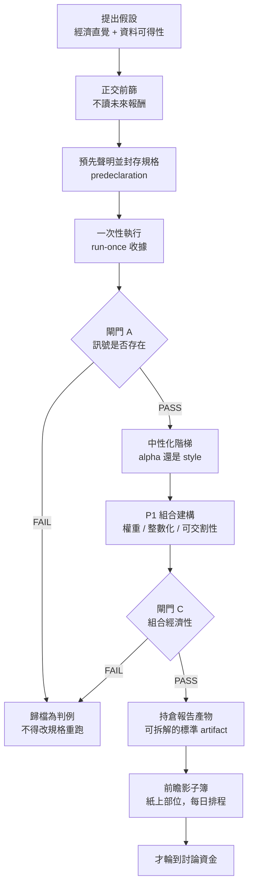
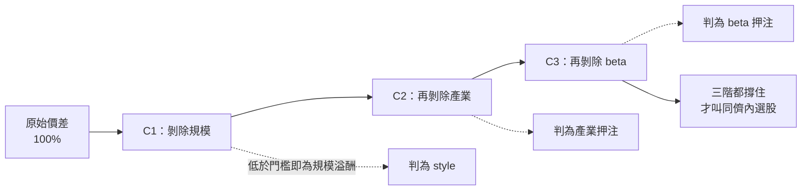

> 這篇談的是**研究流程與工程紀律**，不是投資建議，也不包含任何可直接交易的訊號、參數或標的。文中所有績效相關敘述都是示意性的區間或方向描述，不是實際數字。

## 前言 (Introduction)：真正的敵人不是模型不夠強，是我自己

我做量化因子研究的頭幾個月，最常發生的事情是這樣的：跑出一條漂亮的權益曲線 → 很興奮 → 隔天想「那換個回看窗口試試」→ 更漂亮 → 再換一個排名方式 → 又更漂亮。等到我停下來時，已經沒有人（包括我自己）說得出這條曲線到底是訊號的功勞，還是我試了二十次挑出最好那次的結果。

這件事在學術上有個名字叫 **researcher degrees of freedom（研究者自由度）**：只要你在「看到結果之後」還能調整規格，你的 p 值、你的 Sharpe、你的樣本外都會失去意義。而量化研究的自由度是天文數字等級的——訊號定義、母體、再平衡頻率、持股數、加權方式、成本假設、樣本切點，每一個都能微調，每一個微調都能「稍微改善一下」。

我後來的體會是：**這不是模型問題，是內控問題**。就像交易需要風控、程式需要 code review，研究本身也需要一套自己管自己的制度。這篇文章記錄的就是我這一年多實際跑出來、也實際被自己違反過幾次的那套制度——它不保證賺錢，它只保證「當結果是假的時候，我看得出來」。

到目前為止，這套流程幫我把二十幾個候選因子絕大多數擋在門外。這聽起來很沒有成就感，但它擋掉的每一個，都是一次沒有真的投進去的資金。

---

## 架構設計 (Architectural Overview)：從假設到實盤觀察的單向管線

整套流程最重要的性質是**單向**：每一段只能往下走，不能回頭重跑。任何「回頭」都必須留下紀錄。

幾個我刻意畫進去的邊界：

| 邊界 | 誰擁有 | 為什麼要切開 |
|---|---|---|
| 研究 ↔ 交付 | 研究端產出「目標持倉」，交付端（通知、看板）只負責顯示 | 交付端一旦有權重新排序或拆單，研究結論就不再是被驗證的那個東西 |
| 回測 ↔ 影子簿 | 影子簿是獨立排程、獨立產物目錄 | 回測可以重跑，前瞻紀錄不行；兩者混在一起，前瞻紀錄就會被回測污染 |
| 規格 ↔ 參數 | 規格常數寫死在程式碼裡，**不做成 CLI 參數** | 能從命令列調的東西，半夜三點一定會被調 |

最後一條是我最推薦的一個小設計。把 leverage、持股數、進出場門檻做成指令參數，看起來很「工程」，實際上等於把研究者自由度做成了一個方便的旋鈕。把它變成必須改程式、必須留 commit 的常數，成本瞬間提高，濫用就消失了。

---

## 方法論拆解 (Methodology Breakdown)

### 一、預先聲明：整套制度的地基

在跑任何一次正式測試之前，我會先寫一份規格文件並且 commit 進版控。內容包含：訊號定義、母體、再平衡頻率、持股數、加權方式、成本模型、樣本區間與樣本外切點、**以及預期會失敗的原因**。

規則只有六條，但都是硬的：

1. **先寫死規格再跑。** 順序反過來，這次測試就沒有效力。
2. **只跑一次。** 沒有「再試一個回看長度」，沒有「跑到好看為止」。
3. **FAIL 是完全有效、而且預期中的結果。** 不軟化措辭、不把訊號反過來、不把失敗的因子塞進複合因子裡搶救。
4. **絕不為了改善結果而重切樣本外。** 更動評估窗口只有在「看到新數字之前就決定」而且「同一套規格套用到全部因子」時才成立。
5. **保存失敗的產物。** 它們就是紀錄本身。
6. **執行收據不得刪除。** 我用的做法是每次執行取得一個「一次性收據」，程式在讀到未來報酬之前就先把它建立起來。真的需要重跑（例如程式在讀報酬前就崩了），必須帶著理由覆寫，而且舊的內容會被巢狀保留在同一個檔案裡。**直接把收據刪掉會不留痕跡，這是最嚴重的違規。**

第 6 條是我踩過坑之後補上的。一開始我以為「自律」就夠了，後來發現自律的問題在於它不留證據——三個月後我自己也想不起來這個因子到底是跑第一次還是第三次。收據把「我記得」變成「檔案裡有」。

### 二、正交前篩：唯一可以在封存前做的檢查

有一類檢查是安全的：**它不讀未來報酬**。既然沒有結果可以偷看，就不可能污染後面的測試，也不會誘發改規格的念頭。

我固定做兩件事：

**（a）跟既有因子的橫斷面相關矩陣。** 用逐日的橫斷面等級相關，而且必須遮罩到「兩個因子當天都能評分的交集」——拿一個因子當天根本排不到的名字去算相關，量到的是覆蓋率差異，不是意見差異。

判讀規則：跟既有因子相關係數 ≥ 0.7，就**不是新維度**。不管它 Gate A 過不過，它都不能拿來當分散化的理由。而且我會在聲明書裡先寫下「我預期相關係數是多少」，跑完再對照。

**（b）尾端辨識度。** 這是我覺得最被低估的一個檢查。等級 IC 是拿整個橫斷面算的，但一個只買前 N 名的組合，只活在最極端那一段。如果一個因子在尾端飽和（例如帶有數學上限、一堆名字並列在 0.99 以上），它可以有全程式最高的 IC，同時完全不可交易——因為前十名基本上是從並列的一團裡隨機抽的。

判斷方式很簡單：看「最好的那一名和第 N 名的差距」佔整個橫斷面全距的比例。健康的因子這個比例是雙位數百分比，飽和的因子會低到個位數。

我在這裡學到的另一件事：**飽和的因子不能靠「改成門檻篩選」來救**。那只是把一個飽和的排序換成完全沒有排序。

### 三、閘門 A：訊號到底存不存在

閘門 A 判斷的只有一件事：這個訊號有沒有預測力。它不判斷能不能賺錢，那是後面的事。

我用的是一組全部都要通過的檢查：

| 檢查 | 我的門檻 | 抓的是什麼 |
|---|---|---|
| 擴張式移動窗口的樣本外平均等級 IC | > 0 | 方向 |
| 折疊穩定度（IC 腿 **或** 價差腿） | 任一腿 ≥ 70% 的樣本外折疊為正 | 穩定度，不是強度 |
| 分位數單調性 | 大致單調，不能只有頂端那一格好 | 是不是只靠尾端運氣 |
| 覆蓋率／週轉率／期間衰減 | 不能由少數日期或少數名字驅動 | 集中度風險 |
| 成本代理後的多空價差 | 仍為正 | 毛利不等於淨利 |
| 基本面因子的資料時點 | 必須對齊**實際公告時戳**，不能用申報期限代理 | 前視偏誤 |

第二條我要特別講，因為我親手誤讀過一次，而且產生了錯誤的結論。

門檻寫的是「兩條腿取較大者 ≥ 70%」——分別算 IC 腿的正折疊比例、算價差腿的正折疊比例，然後取較大的那個去比 70%。它**不是**「有多少比例的折疊裡至少有一條腿為正」。後者是一個完全不同、而且永遠比較大的數字：一個 IC 為負但價差為正的折疊，會被算進後者，卻兩條腿都不算。

我曾經用後面那個讀法，把一個 66.7% / 66.7%（雙腿皆不及格）的因子讀成 77.8%（通過）。差別是「不及格」和「及格」。**這種定義層級的歧義，比模型錯誤危險得多，因為它不會報錯。**

補一句相關的：這個門檻是 OR 不是 AND。只靠單腿通過仍算通過，但我會在紀錄裡標註「單腿通過」，因為它實質上比雙腿都過弱很多。

### 四、中性化階梯：分辨 alpha 與 style

這是我認為整套流程裡最有價值、也最少人做的一段。

一個因子的報酬可以來自兩種完全不同的東西：

- **選股（alpha）**：在同一群體內部，挑出比同儕好的標的。
- **曝險（style）**：整個組合系統性地偏向某種特徵——小型股、某個產業、高 beta。

兩者的報酬都是真的錢，但**風險性質、容量、以及會在什麼時候一起爆掉，完全不同**。而且第二種你其實不需要研究——直接持有那個曝險就好了，成本低很多。

我的做法是把訊號逐日對一組控制變數做橫斷面迴歸，取殘差重建組合，看價差還剩多少：

實務上這一階段殺掉的候選比閘門 A 還多，而且死法很有教育性：

- 有一個候選因子**八項機械檢查全數通過**，是當時最強的非現任因子——剝掉規模之後只剩三成，剩下的大半是產業。它是一個包裝得很好的小型股溢酬。
- 有另一個因子在規模這一階幾乎毫髮無傷，卻死在 beta 那一階。「它不是小型股押注」和「它是 alpha」是兩件事。
- 有一個候選在階梯上表現得比現任還穩健——但它的價差本來就比現任小。**更耐中性化但更弱**，不是升級。

### 五、我學到最反直覺的一課：訊號空間的相關性，預測不了報酬空間的存活

這件事我連續猜錯了五次，才承認它是規律而不是巧合。

前篩算出來的相關係數，是**訊號空間**的：兩個排名有多像。中性化階梯量的是**報酬空間**的：這個報酬能不能離開那些曝險而存在。我原本以為前者能預測後者——如果一個訊號跟規模的相關係數接近零，它應該就不是規模押注吧？

實測：

| 候選 | 訊號 vs 規模的相關係數 | 剝除規模後保留的價差 |
|---|---|---|
| A | −0.07（幾乎正交） | 只剩 17%（幾乎全是規模） |
| B | −0.04（幾乎正交） | 保留 85%（真的不是規模） |
| C | +0.13（弱正相關） | 只剩 30% |

三次，方向與大小都預測失敗。結論很硬：**低相關是必要條件，不是充分條件；能判定的只有階梯，不是相關矩陣。** 我還遇過一個跟所有既有因子都近乎完美正交的因子——它的問題是完全沒有預測力。正交而空洞，是一種很常見的狀態。

現在我的做法是：前篩的預測值一樣要寫在聲明書裡，跑完照樣對照，但它**只用來決定「這一槍值不值得開」，不用來下任何結論**。把「我以為」變成可稽核的紀錄之後，我對自己直覺的信任度校正得很快。

### 六、兩條分流軌：承認現實，而不是修改標準

制度跑久了會遇到兩種尷尬狀況。我的處理方式不是放寬門檻，而是開兩條標示清楚的側線。

**（a）Style 軌——把風格曝險攤在陽光下持有。**

適用對象非常窄：機械檢查全數通過、而且**只**死在中性化階梯的候選。訊號規格一個字都不能改（改了就是全新的候選，重新走一次）。它要通過的不是原本的閘門，而是一張「風格報告卡」，鎖定三種已知的死法：

1. **沒有選股價值** → 用「同一條迴歸的擬合值」而不是殘差來建一個安慰劑組合。如果安慰劑就能複製原本的報酬，那你不需要這個因子，你需要的是直接持有那個曝險。
2. **不可交割** → 逐腿檢查實際被選中標的的流動性、成本壓力測試與損益兩平成本。
3. **與現有組合重複** → 報酬相關性與持股重疊率。

只有三關都沒踩到，它才會被歸類為「已聲明的風格組合」——注意用詞：**已聲明**。它不是 alpha，文件裡永遠寫著它不是。

**（b）探索軌——當一段歷史窗口被用完的時候。**

跑到第二十幾次研究時，我必須誠實面對一件事：同一段歷史我已經看過二十幾遍了，再宣稱「這是一次乾淨的樣本外測試」是自欺欺人。家族錯誤率（family-wise error rate）已經無法量化。

處理方式是把制度整個換掉，而不是繼續假裝：

| | 主軌 | 探索軌 |
|---|---|---|
| 歷史窗口的角色 | 樣本外檢定 | **開發樣本**，可自由迭代、可反轉訊號 |
| 誠信機制 | 逐次預先聲明 + 一次性收據 | **append-only 的試驗登錄檔**：每一次評估（含規格雜湊、完整規格、全部檢查數字）在報告之前就先落地 |
| 歷史結果能證明什麼 | 通過即為候選 | **什麼都不能證明**，只能排序 |
| 升級條件 | 通過閘門 C | 凍結規格後，**只有開發從未觸碰過的前瞻資料**能通過 |

換句話說：用「完整的搜尋日誌」換掉「單次預先聲明」，再用「只有未來資料能通過的閘門」換掉「歷史樣本外」。刪掉或過濾登錄檔，整個家族的資格就作廢。

### 七、閘門 C：組合層級的經濟性

訊號存在，不代表組合能活。閘門 C 換一組完全不同的問題：

- 成本後的樣本外 Sharpe ≥ 0.7
- **沒有任何單一年度貢獻超過總損益的 50%**
- 最大回撤 ≤ 20%
- 整數化投影（實際能買的股數／口數）之後，alpha 仍然存在
- 部位、beta、產業殘差都在約束內

第二條是我這邊最常見的死因，遠比 Sharpe 不足常見。一個五年 Sharpe 好看的組合，攤開來卻是「某一年賺完，其他四年橫著走」——那不是策略，那是一次擇時運氣被平均掉了。

第四條也值得單獨講：**在連續權重下成立、在整數投影後消失的 alpha，不能升級。** 連續權重是一個沒有人買得到的組合。我後來的規定是，凡是產生持倉的回測，一律直接跑整數投影，把它當成預設而不是選項。（實測過一次影響是「不重要」——但**「不重要」是一個測量結果，不是一張跳過它的許可證**，每個組合都得自己量一次。）

另外兩件關於成本的事，我付了學費才學會：

- **成本模型是不對稱的。** 我這邊賣出要付稅、買進不用，兩邊用同一個數字會系統性高估。而且不同工具（現貨、衍生品）的成本結構根本是不同模型，不能共用。
- **最低手續費是一個資本下限，不是零頭。** 一個持有兩百多檔的寬組合，在小資金下光是「每筆最低收費」造成的年化拖累，就足以吃掉大部分邊際；同一個組合放大資金規模後，這項拖累會掉到幾分之一。**組合寬度和資金規模是綁在一起的設計決策**，不是兩件事。

### 八、持倉報告：一個沒有人能拆解的總報酬，不算結果

我曾經有一份回測報告掛著一個極高的累積報酬率，掛了好幾天，沒有人（包含我）能回答「這是訊號的功勞，還是四檔股票在某一個特殊時期的功勞」。從那之後我加了一條硬規定：**任何會產生持倉的回測，都必須輸出一整套標準化的可渲染產物。**

而且是用共用的寫入器寫，不准手工組。內容包含：

- 權益曲線，**畫在對數座標上**，並且疊上「等權母體」基準。線性軸會把前三年壓成一條直線；對數軸讓「相同垂直距離 = 相同倍率」。槓桿策略對上無槓桿基準時，比的是**形狀**，不是高度。
- 逐名持倉：股數／口數、權重、進出場動作（新進、退出、續抱且有調整、續抱未動）——讓成本可以逐筆歸因。
- 集中度分解：最大單一名字貢獻、最大單一期間貢獻、逐年貢獻。
- 成本明細：模型成本、最低收費疊加、實際週轉。

這個寫入器最有價值的設計其實很無聊：**它在寫入時就驗證 schema**。欄位缺漏、結構漂移，在產生資料的當下就報錯並指名欄位——它取代的失敗模式，是幾週後某個人剛好想渲染報告時，才在渲染器深處炸出一個看不懂的錯誤。

### 九、影子簿：紙上部位，但用正式系統的規格跑

通過閘門之後，還是不碰真錢。下一站是**前瞻影子簿**：每天由排程產生一份完整的目標持倉，記錄下來，然後等時間過去。

我的影子簿設計原則：

- **每日排程、冪等。** 不是再平衡日就印出「未到期」並正常退出。斷線幾天之後補跑是安全的。
- **狀態是歷史的純函數。** 我的其中一本簿子沒有任何狀態檔：每次執行都從第一天完整重播，並且比對「凍結引擎」的結果，不一致就拒絕寫入。沒有狀態可以損毀、可以不同步，漏跑一週會在下次執行自動癒合。
- **帳本只從已記錄的簿子建立，不從即時重播建立。** 這樣事後的資料修訂沒辦法偷偷改寫前瞻紀錄。
- **產物不進版控。** 部位永遠不 commit。
- **任何規格變動（訊號、延遲、排程、規模、上限）都重啟評估時鐘**，而且要寫進 amendment log。改了東西又沿用舊的觀察期，等於沒有觀察期。
- 評估標準必須**事先寫好**：觀察多少個交易日、要檢查什麼（方向一致性、實現成本是否落在模型的容許範圍、每次該成書時是否真的能成書）。

最後一條看起來很像廢話，但我有一本簿子上線的時候，評估標準還沒寫。結果就是它每天勤奮地累積一份**沒有任何人承諾要如何判讀**的紀錄。這比沒有紀錄更糟，因為它會讓你以為自己在驗證。

---

## 生產環境踩坑與優化 (Production Optimization)

這一段全部是真的踩過的，按「痛的程度」排序。

**1. 合併不等於部署。** 我的每日排程跑的是另一份獨立的 clone，它追的是主線但有自己的更新節奏。改完排程腳本、通過 CI、合併進主線——排程跑的還是舊的。而且 CI 永遠看不到這件事，因為排程不在 CI 裡。現在的規則是：合併之後，去把那份 clone 拉起來、**手動觸發一次真正的排程、然後把 log 讀完**。沒讀 log 就不算部署完成。

**2. 全樣本和樣本外的數字混著比。** 診斷工具算的集中度是全樣本，文件裡引用的是樣本外，兩者可以差好幾個百分點。我曾經因此把一個候選寫成「集中度是現任的兩倍」，用同一個窗口重算之後其實是 1.6 倍。現在每一個數字旁邊都必須標窗口，這是文件規範的一部分。

**3. 交割牆：連續權重的 alpha 撞上真實可買的東西。** 我遇過一個真正正交、真正通過的因子，最後死在「它的邊際幾乎全部來自流動性很差的小型標的，在我能用的工具集裡根本組不出那個組合」。更慘的是在某些市場狀態下，符合條件的標的只剩個位數，連最小的組合都湊不出來。這不是訊號的缺陷，是**工具集的結構限制**——但結果一樣：不能交易的 alpha 等於零。所以可交割性檢查要放在算出漂亮的預估報酬**之前**，不是之後。

**4. 目標函數沒講清楚，結論就會互相矛盾。** 我測過一個風險控制機制，用「總報酬」當評分尺是輸的，用「最大回撤 + Sharpe」當評分尺是贏的。同一份實驗、同一批資料、相反的結論。這不是資料的問題，是我沒有在事前把「我到底要最大化什麼」寫下來。現在聲明書裡一定有一行「判定準則」。

**5. 成本必須在最前面，不是最後。** 好幾個毛利為正的因子在扣成本後直接翻成負的——不是勉強，是翻面。我現在的順序是：閘門 A 就用成本代理，閘門 C 用精確的、按工具區分的、不對稱的模型。把成本留到最後才加，等於前面幾週的工作都是在研究一個不存在的世界。

**6. 集中度的預設是壞的。** 一個新做出來的組合，除非證明不是，否則預設它的報酬集中在少數幾年、少數幾檔。我看過某本簿子前十名標的貢獻超過一半，單一標的貢獻近兩成。這件事沒有任何一道自動門檻會擋——因為那本簿子的 Sharpe 很好看。**檢查表不會替你想到你沒放進檢查表的東西**，所以每份結果文件都要有一段「已知脆弱處」，專門寫沒有任何門檻在看的風險。

**7. 別把「疑似無害」當成無害。** 前面提過的整數化投影影響、模型化的停損估計偏保守或偏樂觀、股利稅、碎股單位的成交機率——這些我都標記為「未建模」而不是「不重要」。差別在於：未建模是一筆記在帳上的債，不重要是一個沒有證據的結論。

---

## 圖表與配圖建議 (Visual Plan)

### 1. 單向管線總覽 (One-Way Pipeline)
* **用途**：一眼看懂「假設 → 前篩 → 封存 → 閘門 → 影子簿」是單向的，失敗只有一個出口（歸檔）。
* **位置**：置於架構設計章節開頭，取代文字敘述。
* **圖表說明**：`整套流程唯一的設計目標，是讓「回頭改規格」這件事變得昂貴而且留下痕跡。`
* **靈感來源**：參考 [Excalidraw Libraries](https://libraries.excalidraw.com/) 的 flow／pipeline 元件，或 [Netflix Tech Blog](https://netflixtechblog.com/tag/experimentation) 的實驗平台流程圖風格。

### 2. 中性化階梯瀑布圖 (Neutralization Waterfall)
* **用途**：把「原始價差 → 剝除規模 → 剝除產業 → 剝除 beta」畫成瀑布，讓 style 與 alpha 的差別變成視覺上的。
* **位置**：緊接在階梯的流程圖之後，作為量化版本。
* **圖表說明**：`同一個因子，三根柱子掉完之後剩下的才是選股。掉在第一根，那是規模溢酬。`
* **靈感來源**：參考 [MSCI Factor Models](https://www.msci.com/our-solutions/analytics/factor-models) 說明文件中的報酬歸因瀑布圖。

### 3. 相關性 vs 存活散佈圖 (Correlation vs Survival)
* **用途**：用三到五個點直接證明「相關係數預測不了存活」，這是整篇最強的一個反直覺結論。
* **位置**：置於第五節表格旁邊。
* **圖表說明**：`如果這張圖上的點有規律，我就不需要跑階梯了。它們沒有規律，這就是為什麼要跑。`
* **靈感來源**：學術論文常見的 scatter + 45 度參考線畫法，風格可參考 [Our World in Data](https://ourworldindata.org/) 的簡潔散佈圖。

### 4. 對數軸權益曲線 (Log-Scale Equity Curve)
* **用途**：直接示範同一條曲線在線性軸與對數軸下的視覺差異，說明為什麼報告一律用對數軸。
* **位置**：置於持倉報告章節，並排 before／after。
* **圖表說明**：`同一條曲線。左邊那張讓我以為前三年沒事發生。`
* **靈感來源**：參考 [FRED](https://fred.stlouisfed.org/) 圖表工具產出的長週期對數軸圖。

---

## 總結 (Conclusion)

這套流程如果要給一個名字，我會叫它 **predeclare → gate → shadow**：先把規格封存讓自由度歸零，再用互相獨立、問不同問題的閘門逐層淘汰，最後只讓時間本身來當最終裁判。

我從中帶走的幾個可以直接搬到別的領域的心得：

1. **能調的旋鈕就會被調。** 把研究參數從命令列移進版控常數，是我做過投資報酬率最高的一次「重構」。
2. **不留痕跡的重跑，比重跑本身更危險。** 一次性收據、append-only 登錄檔、amendment log——重點都不是防止你重來，而是保證重來這件事看得見。
3. **相關性回答「像不像」，不回答「能不能活」。** 這兩個問題要用兩種完全不同的工具量，而且我的直覺在後者上面是不可靠的。
4. **不可交易的 alpha 等於零，所以可交割性要往前放。** 把交割檢查放在報酬估計之前，可以省下大量白工。
5. **沒有評估標準的前瞻紀錄，是一種昂貴的自我安慰。** 上線觀察之前，先把「多久之後、用什麼標準判定」寫死。
6. **FAIL 是產出。** 我這套制度絕大多數的輸出是「這條路不通」，而每一個歸檔的失敗，都讓下一個提案少走一次同樣的路。這才是研究資產真正累積的地方——不是那條漂亮的曲線。

---

## Reference

- **[False-Positive Psychology (Simmons, Nelson & Simonsohn)](https://journals.sagepub.com/doi/10.1177/0956797611417632)**：「研究者自由度」這個概念的原始出處，也是本文預先聲明制度的理論基礎。
- **[…and the Cross-Section of Expected Returns (Harvey, Liu & Zhu)](https://doi.org/10.1093/rfs/hhv059)**：對應「家族錯誤率無法量化」那一段——當一個領域已經測過數百個因子，單次檢定的顯著水準不再有意義。
- **[Pseudo-Mathematics and Financial Charlatanism (Bailey & López de Prado)](https://www.ams.org/notices/201405/rnoti-p458.pdf)**：對應第六節「窗口被用完」的問題，以及為什麼要改用前瞻資料當閘門。
- **[A Taxonomy of Anomalies and Their Trading Costs (Novy-Marx & Velikov)](https://www.nber.org/papers/w20721)**：對應「成本必須放在最前面」——大量學術異常現象在扣掉真實交易成本後消失。
- **[Center for Open Science — Preregistration](https://www.cos.io/initiatives/prereg)**：預先聲明在其他學科的成熟做法，我的聲明書格式大量借用了它的欄位設計。
- **[MSCI Factor Models](https://www.msci.com/our-solutions/analytics/factor-models)**：對應中性化階梯——把報酬拆成風格曝險與殘差，是風險模型的標準做法，不是我發明的。
