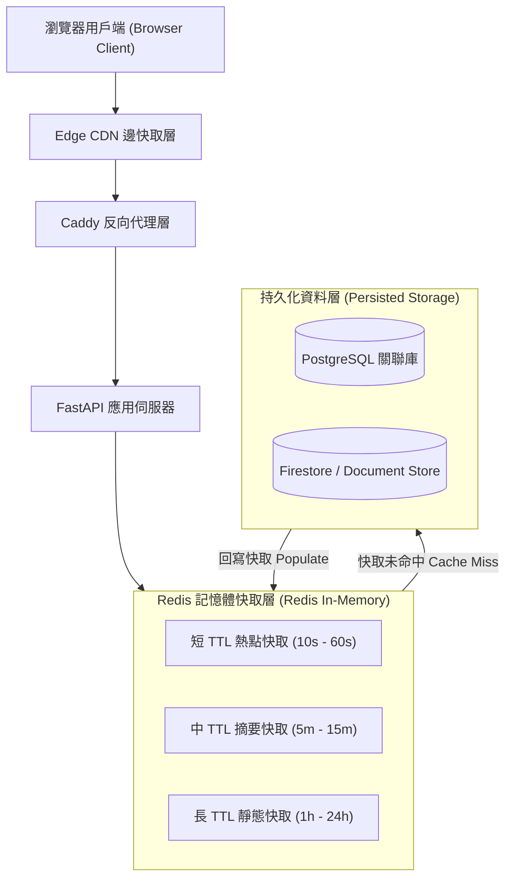
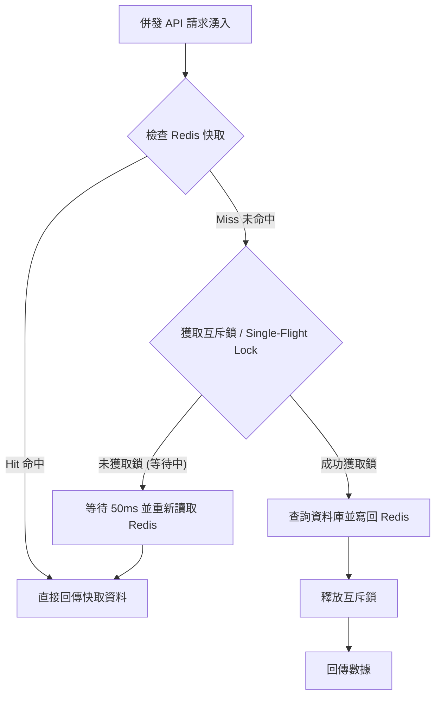

# FastAPI + Redis：高讀取量 API 的快取分層設計

## 前言 (Introduction)

在構建高讀取量（Read-heavy）的全端 Web 應用時，許多團隊最常犯的錯誤之一，就是對快取採取「一刀切」的態度：要麼完全不快取，要麼給所有 API 端點套上相同的固定過期時間（例如 TTL = 5 分鐘）。

然而，在真實生產環境中，不同資料的新鮮度需求（Data Freshness Requirements）天差地別：
* 即時數據與熱門標的行情（如 Market Ticker Data）秒秒都在變化。
* 生成好的 Podcast 節目摘要與財經報告可以允許數分鐘的快取。
* 靜態領域詞彙庫與產業結構圖譜則可能數天甚至數週都不會改變。

如果將所有請求直接丟給後端資料庫，讀取尖峰會瞬間將連線池拉滿；但如果快取策略設計不當，又會面臨快取擊穿（Cache Stampede）、資料不一致與記憶體溢出的風險。

這篇文章我想分享自己在 FastAPI 與 Redis 搭配運作下的快取分層設計方法論，說明如何針對不同讀取特性劃分快取邊界，並防範生產環境常見的快取風暴。

---

## 架構設計 (Architectural Overview)

一個成熟的高效能快取架構，應該包含從用戶端到資料庫的多層防禦線（Tiered Caching Pipeline）：

這套快取分層的設計核心在於 **Cache-Aside 模式** 與 **讀寫分離的鮮度控管**：
* **第一層（Edge & Browser）**：透過 `Cache-Control` 與 `s-maxage` 標頭讓 Edge Network 擋掉絕大多數重複的靜態 GET 請求。
* **第二層（Redis Cache-Aside）**：FastAPI 先查詢 Redis，若存在則直接回傳 JSON；若缺失則查詢資料庫，寫回 Redis 後回傳。
* **第三層（Persistent DB）**：資料庫僅承接真正的 Cache Miss 與寫入交易，確保讀取壓力被完全隔離。

---

## 方法論拆解 (Methodology Breakdown)

### 1. 根據資料新鮮度劃分快取 TTL 矩陣

我們不能給所有 API 相同的 TTL。在實踐中，我將 API 依據讀取特性與容忍度劃分為三種等級：

| 快取等級 | 典型資料類型 | TTL 建議 | 快取策略標頭 (Cache-Control) |
|---|---|---|---|
| **短 TTL (Short-lived)** | 熱門標的行情、最新事件狀態 | 10秒 - 60秒 | `public, max-age=10, s-maxage=60` |
| **中 TTL (Medium-lived)** | 節目摘要、報告內文、關鍵洞察 | 5分鐘 - 15分鐘 | `public, max-age=60, s-maxage=900, stale-while-revalidate=30` |
| **長 TTL (Long-lived)** | 產業圖譜、分類詞彙庫、標的元資料 | 1小時 - 24小時 | `public, max-age=3600, s-maxage=86400` |

透過這種分級，系統在保證數據實時性的同時，將資料庫的讀取壓力降低了 90% 以上。

### 2. 快取擊穿與雪崩防禦 (Cache Stampede Prevention)

當一個高頻讀取的熱點 Key（例如最新熱門報告）正好到期失效，而在同一毫秒內有數百個并发請求同時湧入時，所有請求會同時發現 Cache Miss 並一起向資料庫發起重查。這就是著名的 **Cache Stampede (Thundering Herd)**，極易導致資料庫連線池瞬間崩潰。

我採用了兩大工程機制進行防禦：

* **互斥鎖 / Single-Flight 模式**：當發生 Cache Miss 時，第一個請求會向 Redis 申請一個帶有短超時的互斥鎖（Lock Key）。只有搶到鎖的請求才能查詢資料庫，其餘併發請求則微幅等待並重新讀取 Redis。這確保了無論瞬間併發多高，資料庫永遠只會承受一次查詢。
* **機率性提前過期 (XFetch Algorithm)**：對於極度熱點的資料，系統在快取即將過期的最後 10% 時間內，以機率觸發背景非同步更新（Asynchronous Revalidation），在用戶完全無感知的情況下補齊快取。

### 3. 快取 Key 的命名空間與版本化設計

快取 Key 如果缺乏統一的命名規範，極易在部署新版本時引發舊格式快取污染新程式碼的悲劇。

我採用了階層式的 Key 命名空間格式：

`{environment}:{domain}:{entity_type}:{version}:{entity_id}`

這種設計的好處是：
- **環境隔離**：`prod:market:ticker:v1:2330` 與 `staging:market:ticker:v1:2330` 完全隔離，絕無混淆可能。
- **版本控制**：當後端 Pydantic Model 發生 breaking change 時，只需將 Key 的版本號升級為 `v2`，系統會自動忽視舊版快取並逐步建構新快取，無需緊急手動 Flush 全庫。

---

## 生產環境踩坑與優化 (Production Optimization)

### 1. 序列化與反序列化的 CPU 負擔

早期的實作中，我們將複雜的 Python 物件透過 ORM 轉為 Dict，再用 JSON 序列化存入 Redis；讀取時又再次執行反序列化與 Pydantic 驗證。在高併發下，JSON 序列化與 Pydantic 驗證反而成為了 CPU 的效能瓶頸。

**優化方案**：在 FastAPI 中，可以直接將已序列化的 JSON 字串直接快取在 Redis 中，並使用原生 Response 對象繞過 Pydantic 的重複驗證，直接將 Byte 流輸出給客戶端，讓回應時間降至毫秒級。

### 2. 忽略 Memory Eviction 策略與大 Key 問題

Redis 是記憶體資料庫。如果沒有設定 `maxmemory` 以及正確的驅逐策略（Eviction Policy，如 `volatile-lru`），一旦快取資料暴增，Redis 會直接因 Out of Memory (OOM) 被作業系統強行殺掉。

另外，避免在 Redis 中儲存巨大的單一 Key（如包含數萬筆個股歷史紀錄的大型 JSON）。大 Key 在讀取與刪除時會阻塞 Redis 的單一執行緒事件迴圈（Event Loop），應切分為小 Key 或使用 Hash 結構。

### 3. 無監控的 Cache Miss 狂飆

如果沒有監控命中率，快取系統很容易變成「假運作」。如果某次代碼修改導致 Cache Key 格式寫錯，系統可能 100% Cache Miss 卻表面無異常，直到資料庫被壓垮。

我們在 FastAPI 中增加了快取觀測指標：在回應 Header 中帶入 `X-Cache: HIT` 或 `X-Cache: MISS`，並透過日誌監控整體快取命中率（Target > 85%）。

---

## 圖表與配圖建議 (Visual Plan)

### 1. 多層快取防禦線拓撲圖 (Tiered Caching Topology)
* **用途**：展示 Browser, Edge CDN, Redis 與 Database 間的請求攔截關係。
* **位置**：置於架構設計開頭。
* **圖表說明**：`請求過濾金字塔：Edge CDN 擋掉大量重複請求，Redis 承接絕大多數動態查詢。`

### 2. 快取擊穿 (Cache Stampede) 與互斥鎖運作圖
* **用途**：視覺化展示 Thundering Herd 發生時，Single-Flight Lock 如何保護資料庫。
* **位置**：置於方法論快取擊穿章節。

---

## 總結 (Conclusion)

快取設計不是簡單地「呼叫 `redis.set`」，而是一套關於**資料新鮮度、邊界隔離與失敗防禦**的工程系統。

透過將 FastAPI 與 Redis 進行階層化結合：
1. **依據資料特性劃分 TTL 矩陣**（短/中/長）。
2. **引入 Single-Flight 鎖防範 Cache Stampede**。
3. **實作版本化 Key 命名空間防止格式污染**。
4. **繞過不必要的重複序列化**以極致化 CPU 效能。

這套快取架構能夠讓系統在面臨突發流量與讀取尖峰時，依然維持極低的端到端延遲與絕佳的資料庫穩定度。

---

## Reference

- **[Redis Caching Strategies & Best Practices](https://redis.io/solutions/caching/)**：理解 Cache-Aside、Write-Through 與 Read-Through 等經典快取模式。
- **[FastAPI Official Documentation](https://fastapi.tiangolo.com/)**：學習 FastAPI 異步路由處理與 Custom Response 設計。
- **[MDN Cache-Control Guidelines](https://developer.mozilla.org/en-US/docs/Web/HTTP/Headers/Cache-Control)**：理解 HTTP 標頭中 max-age, s-maxage 與 stale-while-revalidate 的行為規範。
- **[Optimal Probabilistic Cache Expiration (XFetch)](https://vldb.org/pvldb/vol8/p886-vattani.pdf)**：深入研究防止 Cache Stampede 的機率性提前過期演算法論文。
