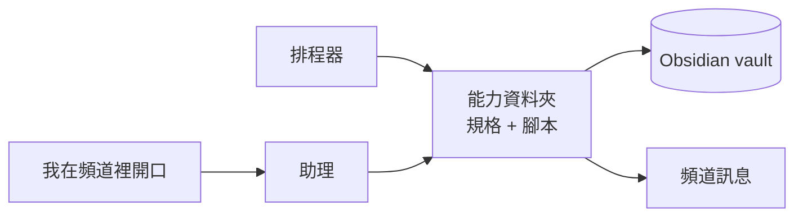
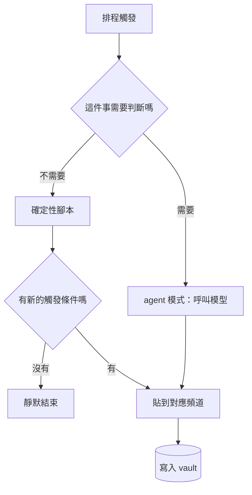

先說清楚：這是我自己在用的一套配置，不是產品，也沒打算變成產品。這篇想記錄的是，當我不再把它當成「一個會回答問題的機器人」，而是當成「一個常駐在背景、有自己時程的東西」之後，設計上到底有哪些地方變了。

chatbot 的存在是被開啟的。你打開視窗、問問題、關掉，它就不存在了。我這套東西剛好相反：它一直在跑，而且它每天對我說的話，大部分不是我當下問的 —— 是它自己決定該在那個時間點講的。

這個差別聽起來像是「多了排程功能」，但實際做下去會發現，它改寫的是整套設計的優先順序。

---

## 它到底是什麼

物理上很無聊：一台放在家裡、不關機的小電腦，上面跑一套 **Hermes Agent**（Nous Research 的開源 agent runtime），用它的訊息閘道連到 Discord，加上它內建的排程器。旁邊有一個 Obsidian vault（就是一堆 Markdown 檔案加上 git），那是它的長期記憶。

我每天實際會收到的東西，大致是市場時段前後的摘要、幾個帳戶的權益數紀錄、當天的日誌，以及系統自己出事時的警報。細節不重要，重要的是：這些訊息我沒有一次是主動去要的。

以下是我認為讓它不像 chatbot 的六個特性，按重要性排。

---

## 一、常駐主動：它決定時機，不是我

這是根本差異，其他五點都掛在這上面。

一旦助理可以主動開口，「它該說什麼」就不再是最難的問題，「它該在什麼時候說」才是。而這個問題沒辦法靠模型解決 —— 它是一個關於我的生活作息的問題。

我後來把它變成一條硬規則：**一則提醒必須同時滿足「我醒著」和「窗口還開著」，否則就不要送**。在市場收盤後才送到的分析，內容再完整都只是資訊，不是行動。這條規則讓我砍掉了好幾個看起來很有用、但送達時間根本沒人能反應的排程。

反過來，這也代表助理必須有「不說話」這個選項，而且要把它當成正常結果，不是異常。

---

## 二、它住在 Discord 裡：不做新介面

我沒有做 app，沒有做 dashboard，沒有做網頁。它就在我本來每天都開著的 Discord 裡講話。

這是它活過第二週的真正原因。

任何需要我「特地去打開」的介面，最後都會變成我不去打開的介面。而 Discord 我本來就開著，訊息會推播到手機，歷史紀錄天生就有，多人多裝置同步不用我處理。我等於是免費拿到了通知系統、收件匣和存檔。

代價是我要接受它的形式限制 —— 訊息長度、排版、沒有互動元件。但那些限制反而逼我把每則訊息壓到「掃一眼就知道要不要點進去」的長度，這對一個每天講十幾次話的東西來說是好事。

---

## 三、頻道即角色：路由、記憶範圍、人格是同一個決定

Discord 的頻道被我拿來當成整套系統的路由表。

一個頻道 = 一個角色 = 一份 prompt = 一個歸檔目的地。問市場的、問研究的、問技術的、看報表的、看警報的，各自有自己的頻道，各自有自己的人設與資料權限，產出的檔案也各自落在 vault 的不同資料夾。

這個做法的好處是它同時解決了三件事：我不用跟助理說明現在的情境（頻道就是情境）、助理不用猜這次對話該存去哪（頻道決定歸檔）、而我要調整某個角色的行為時，改的是一份獨立的 prompt，不會波及其他角色。

我後來還加了一條分類原則，把頻道分成三種：**互動型**（我會在裡面對話）、**餵料型**（單向餵資料給我，我不在裡面講話）、**引擎型**（觸發長時間運算）。分完之後，好幾個「不知道該放哪」的功能自己就有家了，也有兩三個頻道因為職責重疊被我合併掉。

---

## 四、能力是檔案，而且有兩個入口

助理的每一項能力，實體上就是一個資料夾：一份 `SKILL.md` 說明它幹嘛、什麼時候該用，加上幾支腳本。這是 Hermes 的 skill 格式，也是我擴充它的唯一入口。

關鍵在於**同一支腳本有兩個呼叫入口**：排程器可以在早上八點半自己喊它，我也可以在聊天視窗裡直接叫它跑。兩邊跑的是同一份程式碼，沒有「排程版」和「互動版」的分裂。

這件事聽起來理所當然，但它擋掉了一整類問題。能力放在檔案系統上，就代表它可以進版控、可以 diff、可以在本機單獨執行來除錯，也不會有一份藏在某個執行期註冊表裡、只有服務跑起來才存在的隱形設定。我要知道這個助理會做什麼，只要 `ls` 一個資料夾。

---

## 五、記憶是純文字

它學到、產出、記下的所有東西，最後都是 Markdown 檔案，躺在一個 git 倉庫裡，我用 Obsidian 打開、用 grep 搜、也可以直接手改。

助理和我讀寫的是同一個儲存體 —— 這點比「用什麼資料庫」重要得多。它今天寫的摘要，我明天可以直接編輯；我手寫的一則筆記，它下次可以讀進去當背景。中間沒有匯入匯出，沒有格式轉換。

為了讓這件事在兩邊都在寫的情況下不炸掉，我只加了兩個約束：

- **每個資料夾有一份最小的欄位契約**（類型、日期、來源之類的 frontmatter），這樣不用讀內文就能過濾、統計、驗證。另外有一個每天跑一次的檢查程式 —— 它本身不用模型 —— 專門抓漏欄位的檔案。
- **寫檔的人只管寫檔，只有一個掃描程式擁有 git**。每隔一段時間它負責提交、拉取、變基、推送，其他所有產生檔案的地方一律不碰 git。多個 writer 各自 commit 是我最早期最大的衝突來源，收斂成單一擁有者之後就安靜了。

---

## 六、有契約，也有判例

這是我覺得最少人做、但回報最高的一件事。

助理有一份常駐的**行為契約**：它該用什麼身分做事、每次對話結束前該留下什麼、什麼類型的請求該走哪條流程。這份契約是一個檔案，不是散落在各個 prompt 裡的語氣描述。

在契約之外，我還開了一個**判例庫**：每次遇到需要判斷的情境（該不該做、用哪個方案、為什麼否決），結論會被寫成一則判例存起來。下次遇到類似情境，先查判例，而不是重新用當下的心情再判一次。當某條判例重複出現到夠多次，它就會被升格寫進契約。

這樣做的結果是，助理的行為變成一個**可追蹤的產物**：我可以 diff 它、可以回頭問「這條規則什麼時候出現的、為什麼」。相比之下，把行為藏在 prompt 裡，改動是不可見的，而且半年後沒有人記得為什麼要那樣寫。

---

## Hermes 的 agent 機制：我為什麼沒有自己寫一個

上面六點是我自己的設計決定。但有一半的東西我根本不用做，因為 Hermes 已經把最難的部分處理掉了 —— 而且處理的方式比我原本會寫的聰明。

**一、skill 有三種來源，其中一種是它自己寫的。** 內建的、我從 hub 裝的、以及 agent 從實際經驗裡自己長出來的。第三種才是關鍵：我不需要預先想好它該會什麼。

**二、有一個 curator 在背後整理這些 skill。** 它是一個背景任務，在助理閒置、而且距離上次整理超過一段時間之後自己啟動（不需要另外排 cron），去審視 agent 自己寫的 skill：標記過期的、合併重疊的、封存沒在用的。三條硬規則我特別欣賞 —— 只碰 agent 自己寫的（我手寫的和裝來的一律不動）、永遠不刪只封存（可還原）、被 pin 起來的完全豁免。一個會自我擴充的系統如果沒有這層，遲早會被自己產生的垃圾淹死。

**三、每一回合結束後，它 fork 自己去做背景複盤。** 主對話回完之後，一個背景執行緒拿同一份對話快照跑一個分身，問一個問題：這回合有沒有什麼該被記下來、或該變成一個 skill？

實作細節才是重點：這個分身**繼承主 session 的 runtime**（同一個供應商、模型、憑證、已快取的 system prompt），所以它命中同一份 prefix cache；它的**工具被白名單限制成只有記憶與 skill 管理**，其他一律在執行期擋掉；而且它**完全不碰主對話的 prompt cache**。「這個助理會學習」在這裡不是一句抽象承諾，是一個有邊界、有權限、有成本控制的具體機制。

**四、背景工作走另一顆模型。** curator 和其他輔助任務用的是獨立的 auxiliary client，跟主對話分開。便宜的模型做整理，好的模型留給需要動腦的對話。

**五、子 agent 有自己的預算。** 需要平行處理時它會開子 agent，每個子 agent 有獨立的 iteration 上限（主 agent 預設 90 次，每個子 agent 50 次）。一個失控的子任務燒掉的是它自己的額度，不會把主線的預算吃光 —— 這是我當初自己寫排程 agent 時吃過虧的地方。

**六、工具是可組合的集合，而且能分開開關。** 工具不是一份全開的清單，可以按平台、按工作分組啟用。研究的頻道給它搜尋工具，貼報表的排程一個工具都不用給。

這些加起來就是我沒有自己造輪子的理由：**一個常駐 agent 最難的不是讓它能做事，是讓它長期做事而不失控** —— 記憶會膨脹、skill 會腐爛、背景任務會偷偷燒錢、子任務會無限迴圈。Hermes 對這四件事都有明確的機制，而不是留給使用者自己想辦法。

---

## 貫穿全部的那條主軸：把模型移出關鍵路徑

上面六點是它的形狀，這一點是它變得可信的原因。

最早，我的排程工作幾乎全都是「叫一個 agent 去做某件事」：讓模型自己去跑腳本、讀資料、寫摘要、貼到頻道。這在示範時很漂亮，在生產環境每天跑就開始一直出事 —— 相對路徑在不同工作目錄下解析失敗、工具呼叫預算中途耗盡、供應商限速、模型某次心情不好就少寫一段。

那一輪我把六個排程從 agent 模式改寫成確定性腳本，配套的資料抓取、格式排版、貼文全部寫死。整整一類故障就這樣消失了。

現在每個排程工作進來，我先問一個問題：**這件事需要判斷嗎？**

需要判斷的（研究、綜合、對話）走模型；不需要判斷的（每天同一時間、同一格式、同一份資料）走腳本。模型負責它真正擅長的那件事，而不是負責「準時」。

### 在 Hermes 裡，這個選擇是一個欄位

這也是我覺得「怎麼用 Hermes」最關鍵的一點：**每一個排程工作都自己帶著它的執行策略**。同一個排程器裡，每個 job 可以各自指定要不要進 agent 模式、用哪個模型與供應商、開哪些工具集、掛哪些 skill、要不要把前一個 job 的輸出帶進來當上下文。

所以「這件事需要判斷嗎」不是一個哲學問題，是一個欄位。

我現在有 41 個排程工作，其中 **39 個不進 agent 模式** —— 純腳本，完全不碰模型。剩下兩個是真的需要判斷的（週回顧、每日日誌），它們才拿得到模型和工具。這個比例本身就是這篇文章的論點。

這裡有個延伸的踩坑值得記下來：設定檔裡的預設模型某天被供應商下架了，之後每一次呼叫都先燒掉三次重試才掉到備援模型上。功能面上沒人發現異常，因為備援真的有接住 —— 直到我去翻錯誤日誌，發現同一則 404 已經累積了幾百次。**備援機制會讓故障變得沉默，所以備援本身也需要被監控。**

---

## Hermes 給我的，和我得自己設計的

我覺得這是整篇最實用的一段。

**Hermes 給我的**：訊息閘道（它支援二十幾個平台，我只用了 Discord）、排程器、skill 的載入與自我擴充機制、curator、背景複盤的分身、可組合的工具集、輔助模型、子 agent 的預算隔離。這些是現成的，設定一下就能跑，而且如上一節所說，它們解掉的正是最難自己寫對的那一類問題。

**我得自己設計的**：純文字的記憶層與它的欄位契約、通知的紀律（什麼時候該閉嘴）、頻道的職責切分、行為契約與判例庫、以及把想法變成工程項目的那條管線。

換句話說，runtime 幾乎不是問題。難的是那些沒有人幫你決定的東西 —— 它什麼時候可以打斷我、它記住的東西放在哪、它做決定時依據什麼。這些沒有一項是「接上模型」或「換個框架」能解決的。

---

## 它會自己長

最後一個特性，是我後來才加上去、但改變最大的：助理不只執行，它還負責把「想法」變成「被追蹤的工程」。

以前我在對話裡冒出來的點子，最好的下場是變成一則沒人再打開的筆記。現在每個新點子都會被拉去對一組固定的評分軸（現金流、資料可行性、工程規模、通路、兩週內能不能驗證、什麼情況下該砍掉），最後產出一個明確的裁決：做、擱置、砍掉、還是先研究。

裁決是「做」的，會直接被開成一張帶完整背景的工程票，交給寫程式的那條流水線去接。我的角色只剩下審查結果。

這件事的價值不在自動化，在於**它讓「想法」有一個固定的死法**。點子不會慢慢變淡然後消失，它會被明確地判定為擱置或砍掉，並且留下理由。

---

## 收尾

如果要我把這整套東西壓成一句話：**個人助理的價值不在它多會講話，在於它每天準時、安靜，而且你敢相信它給你的數字。**

會講話是模型給的，那部分現在很便宜。準時、安靜、可信不是模型給的 —— 那些是排程、契約、驗證、還有大量關於「什麼時候不要說話」的判斷堆出來的。這也是為什麼在我這套配置裡，最不重要的那一塊，反而是模型本身。

---

## Reference

<a class="ref-card" href="https://hermes-agent.nousresearch.com/docs/" target="_blank" rel="noreferrer"><strong>Hermes Agent 官方文件</strong>這套助理跑的 runtime，上面所有 agent 機制的出處。</a>
<a class="ref-card" href="https://github.com/NousResearch/hermes-agent" target="_blank" rel="noreferrer"><strong>Hermes Agent 原始碼（GitHub）</strong>MIT 授權。文中提到的 iteration 預算、背景分身的工具白名單這些細節，都可以直接在原始碼裡對照。</a>
<a class="ref-card" href="https://agentskills.io" target="_blank" rel="noreferrer"><strong>Agent Skills 開放標準</strong>「能力是檔案」背後的 SKILL.md 格式，Hermes 的 skill 與它相容。</a>
<a class="ref-card" href="https://obsidian.md" target="_blank" rel="noreferrer"><strong>Obsidian</strong>我用來讀寫那層純文字記憶的工具。</a>
<a class="ref-card" href="https://discord.com/developers/docs/intro" target="_blank" rel="noreferrer"><strong>Discord 開發者文件</strong>讓「頻道即角色」成立的 bot 與 webhook 能力，以及它們的限制。</a>

