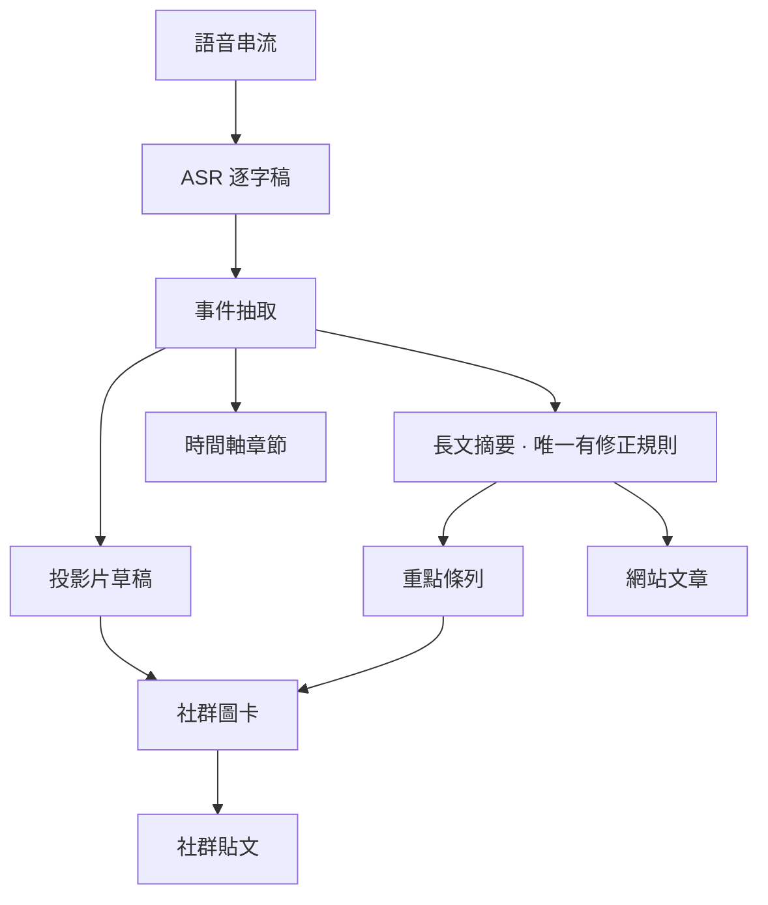
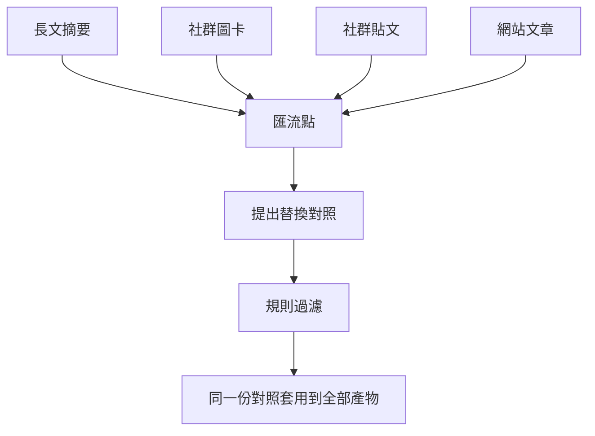

## 前言 (Introduction)

起點是一則讀者留言：「希望出圖前至少檢查一下，每一篇都有不少錯字。」

我第一個反應是去看監控。結果很尷尬——那個月這條**財經 Podcast** 內容 pipeline 沒有任何一個節點失敗過。轉錄成功、事件抽取成功、摘要成功、圖卡渲染成功、社群貼文發佈成功。每一格都是綠的，重試次數是零。

然後我花了大半天，挖出六個彼此獨立的缺陷。**沒有一個是「失敗」。**每一個都是某個元件正確完成了它被交代的工作、回報成功，而錯誤發生在它沒被交代的那一寸——或者更麻煩的，發生在兩個元件之間那個沒有人負責的縫隙裡。

這篇是那半天的紀錄。主題其實不是語音辨識、也不是 CSS，而是一個我後來寫進自己 review 清單的問題：**這個「成功」訊號，是承重的嗎？**

## 架構總覽 (Architectural Overview)

先把場景講清楚。這條 pipeline 把一集數十分鐘的語音串流，變成一篇網站文章、一組社群圖卡、一則社群貼文，中間還要把提到的**市場標的數據**連起來。

這張圖唯一重要的地方，是那個扇出（fan-out）：**事件抽取之後分成兩條路**，一條走長文摘要，一條走投影片與圖卡。而讀者看到的東西，兩條路上都有。

我當初寫過一條 prompt 規則，叫模型「靜默修正明顯的同音誤植」。它只寫在其中一個節點的 prompt 裡。

## 方法論拆解 (Methodology Breakdown)

### 一、修好了，但沒有人用到

我先去比對同一集裡各個欄位的用字。結果讓我愣了一下：

長文摘要那條路，公司名 19 次全部正確。抽取節點，一半對一半錯。投影片與圖卡，全錯。

也就是說——**修正機制一直有在運作，而且運作得很好**。有那條規則的節點確實把名字修對了。問題是圖卡不讀那個節點的產出，它讀的是另一條分支。同一集內容，同時以兩種寫法出版：網站文章上是對的，社群圖卡上是錯的。

這是這次最貴的一課，而且它跟 AI 無關：

> 一個修正如果沒有流到最終產物，它就不是修正，它只是一個讓儀表板好看的中間值。

我原本的直覺是「那就把規則補到另外三個 prompt 裡」。但那是四份會各自漂移的規則，而且它們本來就是各自漂移才出事的。真正的修法是把修正搬到**匯流點**：跑一次，產生一份「錯的寫法 → 對的寫法」對照表，然後把同一份對照表套到每一個產物上。

「同一份對照套用到全部」才是重點。它不只是修掉錯字，它讓**一集內容在結構上不可能自我矛盾**。

至於「讓模型自由提出替換」有多危險——我用三條純規則收斂：替換前後**字數必須相同**（同音誤植天生等長，長度變了就是改寫）、被替換的字串**必須真的出現在文本裡**、一集**最多十二組**（超過就不是校對，是在改文章了）。模型只有提案權，決策權在確定性的程式碼手上。

### 二、同一個模型，一個有規則、一個沒有

到這裡我還在懷疑：這是不是模型能力不夠？換個更強的模型是不是就好了？

資料剛好給了我一個很乾淨的對照組。那四個節點在部署設定上跑的是**同一個模型**。同一集、同一份逐字稿、同一個模型：

| 節點 | 有沒有同音修正規則 | 結果 |
|---|---|---|
| 長文摘要 | 有 | 全對 |
| 事件抽取 | 沒有 | 一半對一半錯 |
| 投影片草稿 | 沒有 | 全錯 |
| 重點條列 | 沒有 | 繼承錯的 |

同一個模型，給了規則就修對，沒給就不修。這不是能力問題。

反向證據更直接：我後來寫的那個匯流點修正，用的也是同一個模型，換了 prompt 跟位置之後，三個案例第一次跑就全中。**模型一直有這個能力，只是從來沒有被要求。**

排下來，成因的權重跟我原本的直覺完全相反：**接線 > prompt 範圍 > 設定漏掉 > 模型能力**。最大的一項不是 prompt 文字，是「修好的東西沒被下游用到」——就算把那條規則寫到完美，圖卡還是錯的，因為它根本不讀那個節點。那是資料流問題，改 prompt 碰不到。

## 生產環境踩坑與優化 (Production Optimization)

上面兩個是設計問題。接下來四個是「回報成功的訊號」，每一個都差點騙過我。

### 三、把它修在源頭，量出來反而更糟

第三項成因看起來最該修：語音辨識支援一個詞彙提示（vocabulary prompt），可以把解碼器往一組已知專有名詞偏。名字在原始逐字稿就對，下游全部受惠——教科書等級的「治本」。

我接好了，然後做了一件很多人會跳過的事：**拿真實音檔做 A/B**。三個節目、四段音訊、每組跑兩三次。

| 音檔片段 | 沒有提示 | 加了 14 詞提示 |
|---|---|---|
| 片段 A | 公司名錯（聽成不相干的疊字詞） | **正確** |
| 片段 B | 公司名錯、慣用語錯 | 公司名**正確**、慣用語仍錯 |
| 片段 C | 一個普通動詞**正確** | 那個普通動詞**變錯了** |
| 片段 D | 164 字正常內容 | **12 字幻覺字幕** |

第三列是我沒有預期的：把解碼器往一個詞表偏，**旁邊的普通詞也會被拖過去**。它修好一個名字，同時把一個本來正確的日常動詞換成同音的錯字。而且下游沒有任何機制看得出來——匯流點的修正只會覺得那是原文。修一個錯，換一個新錯。

第四列更嚴重。那段是我**隨便**挑的對照組，不是刻意找的邊緣案例，而且每一種提示變體都把它毀掉：32 秒的密集市場評論，變成一句「詞曲 ○○○」之類的幻覺字幕。有一次我只是把提示裡兩個區塊的**順序對調**，整段就崩了。

於是這個功能最後是**接好、預設關閉**、用一個環境變數才打開，並在原始碼裡寫下量測結果。

「修在源頭」是一個**直覺**，不是一個**結論**。當一個修正的作用域比你要修的東西大——詞彙提示影響的是整段解碼，不只是那個名字——它的副作用也會比你預期的大。

### 四、我的守門員看錯了訊號

第四列是資料遺失等級的失敗，不能只靠「預設不要開」。所以我寫了一個防護：偵測到疑似崩潰就不帶提示重跑，取字比較多的那個結果——誤判只花一次 API 呼叫，不可能讓輸出變差。

問題是第一版的偵測訊號選錯了。我用的是「**時間涵蓋率**」：回傳片段如果只覆蓋音訊的一小段就判定崩潰。聽起來完全合理。

實際跑下去，防護一次都沒觸發。我把回應攤開來看才發現：那次崩潰的回應**回報了一個橫跨全部 32 秒的片段**，然後在裡面放了 12 個字。涵蓋率 100%。

改成「**字元密度**」（每秒字數）之後就準了——我量到這類節目的正常語速是每秒 4.5 到 5.6 個字，而所有崩潰案例都低於 2。端到端驗過：崩潰那段從 12 字救回 164 字，而提示有幫助的那段保住了它修正後的名字。

這件事讓我很不舒服，因為我寫那個防護的時候是有自信的。教訓很短：

> 一個沒有對著真實故障驗證過的守門員，只是一段讓你安心的程式碼。

寫完防護一定要拿當初那個壞掉的輸入餵它一次。我如果沒餵，就會帶著一個永遠不會觸發的防護上線，而且完全不知道。

### 五、200 OK，但裡面只有六筆

圖卡上還有另一個症狀：個股欄位有將近三成直接顯示代號數字，而不是公司名稱。

追下去是一行判斷式。註冊表的載入邏輯是「先打平台 API，失敗才用本地種子檔」，而「失敗」的定義寫成了「回傳不是 null」。

那個 API 完全健康，回 200，回了一個合法的陣列——只是它的語意是「有人工維護別名的那些列」，總共六筆。程式碼把這六筆當成整份註冊表，於是本地那份兩千多筆的種子資料**永遠沒有機會被讀到**。

`回應不是 null` 和 `回應有我要的東西` 是兩個不同的命題，而我把它們寫成了同一行。修法是把兩份資料**合併**而不是二選一：本地種子當底，平台資料覆蓋。順手也把要顯示的名稱改成直接去問翻譯表拿。

### 六、規則寫對了，只是從來沒生效

最後一個是版面。封面圖的副標題常常被切掉，而且切得很難看——不是在行尾收掉，是**從字的中間橫切**，第二行只剩上半截，第三行整行消失。

我先去看 CSS，那裡明明白白寫著「最多三行」的截斷規則。規則是對的。

真正發生的事情是：外層是一個直向的 flex 容器，副標題是其中一個 flex item，而且設了溢出隱藏。內容一超過可用高度，**flex 先把這個盒子壓扁**（flex-shrink 預設是 1），盒子被壓到比一行還矮，然後溢出隱藏就從字的中間切下去。那條「最多三行」的規則從來沒有機會生效——輪到它的時候，盒子已經不到一行高了。

兩個修正：關掉壓縮（這樣就算要裁，也裁在行邊界並帶省略號），再補上依內容量自動降字級的層級——這套機制在同一個檔案裡的另一種卡片上早就存在，只是封面從來沒接上。掃過近百集的資料，**約三分之二的封面都在溢出**，這也對上了讀者說的「常常」。

我特別喜歡這個案例，因為它是這六個裡最不像 AI 問題的一個，卻是同一個形狀：**一個寫得完全正確的規則，在一個它永遠拿不到控制權的位置。**

## 總結 (Conclusion)

把六個案例的訊號攤開來看，它們是同一件事：

| 回報的訊號 | 它其實沒有說的事 |
|---|---|
| 摘要節點修正成功 | 修正過的版本不是出版的那份 |
| API 回 200 與一個合法陣列 | 陣列的語意不是「全部」 |
| 語音回應涵蓋全長音訊 | 裡面只有 12 個字 |
| 截斷規則存在且正確 | 盒子在它生效前就被壓扁了 |
| 詞彙提示修好了目標詞 | 它同時弄壞了旁邊的普通詞 |
| Pipeline 全綠、零重試 | 沒有任何一個檢查在看內容對不對 |

所以最後那條最貴：**這條 pipeline 的每一個檢查都在問「這一步有沒有跑完」，沒有一個在問「跑出來的東西對不對」。**在一條每個節點都會成功、但每個節點的輸出都可能有內容瑕疵的系統裡，「跑完了」跟「對了」之間的距離，就是使用者會看到的全部東西。

我帶走三條，現在寫在 review 清單上：

1. **修正要放在匯流點，不要放在分支。**只要一個產物是從另一條路長出來的，補在分支上的規則就會漏掉它。一份對照套用到全部，才讓「自我矛盾」在結構上變成不可能。
2. **每個「成功」訊號都要問一次是不是承重的。**`不是 null`、`涵蓋全長`、`規則存在`——這三個都是真的，也都跟我要的東西無關。
3. **修在源頭是直覺，不是結論。**先量。而且要注意作用域：一個修正如果影響範圍比你要修的東西大，它的副作用也會比你預期的大。

還有一個比較不好意思承認的：這六個缺陷全部都在讀者留言之前就存在，而且會一直存在下去，因為**沒有任何一個會讓儀表板變紅**。真正發現它們的不是監控，是一個願意留言的使用者。這件事本身也值得放進系統設計裡想一想。

## Reference

- [MDN — CSS Flexible Box Layout: Controlling ratios of flex items along the main axis](https://developer.mozilla.org/en-US/docs/Web/CSS/CSS_flexible_box_layout/Controlling_ratios_of_flex_items_along_the_main_axis) — `flex-shrink` 預設值為 1，以及溢出隱藏在被壓縮的 flex item 上的行為。
- [OpenAI — Speech to text: prompting](https://platform.openai.com/docs/guides/speech-to-text#prompting) — Whisper 的 prompt 參數語意（它模擬「前一段語音」，因此保留的是尾端），以及提示長度上限。
- [Google SRE Book — Monitoring Distributed Systems](https://sre.google/sre-book/monitoring-distributed-systems/) — 為什麼「元件存活」類的指標無法回答「使用者拿到的東西對不對」。
- [Martin Fowler — Data Mesh Principles](https://martinfowler.com/articles/data-mesh-principles.html) — 資料產物的所有權邊界；本文的「匯流點」修正本質上是把所有權從分支收回到單一負責點。
